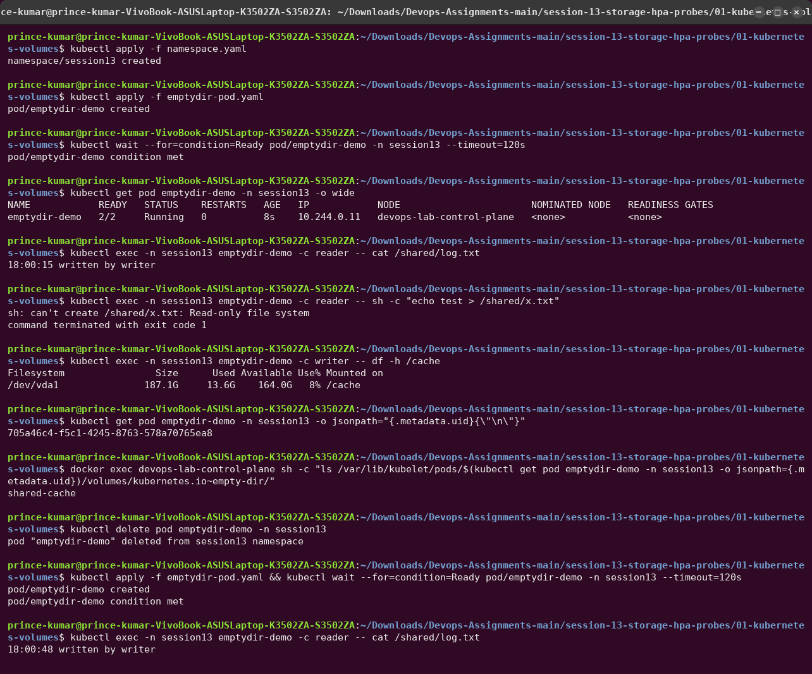
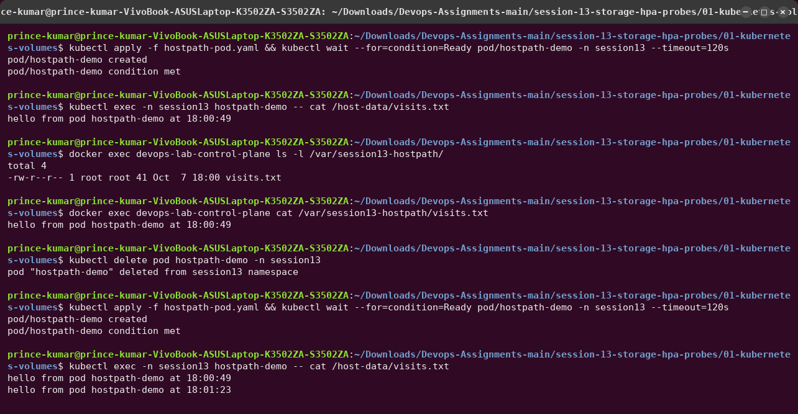
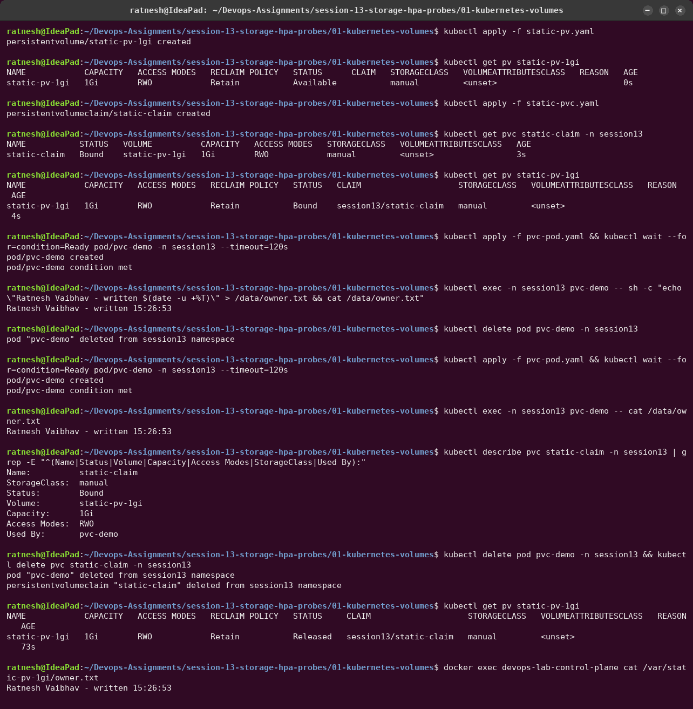
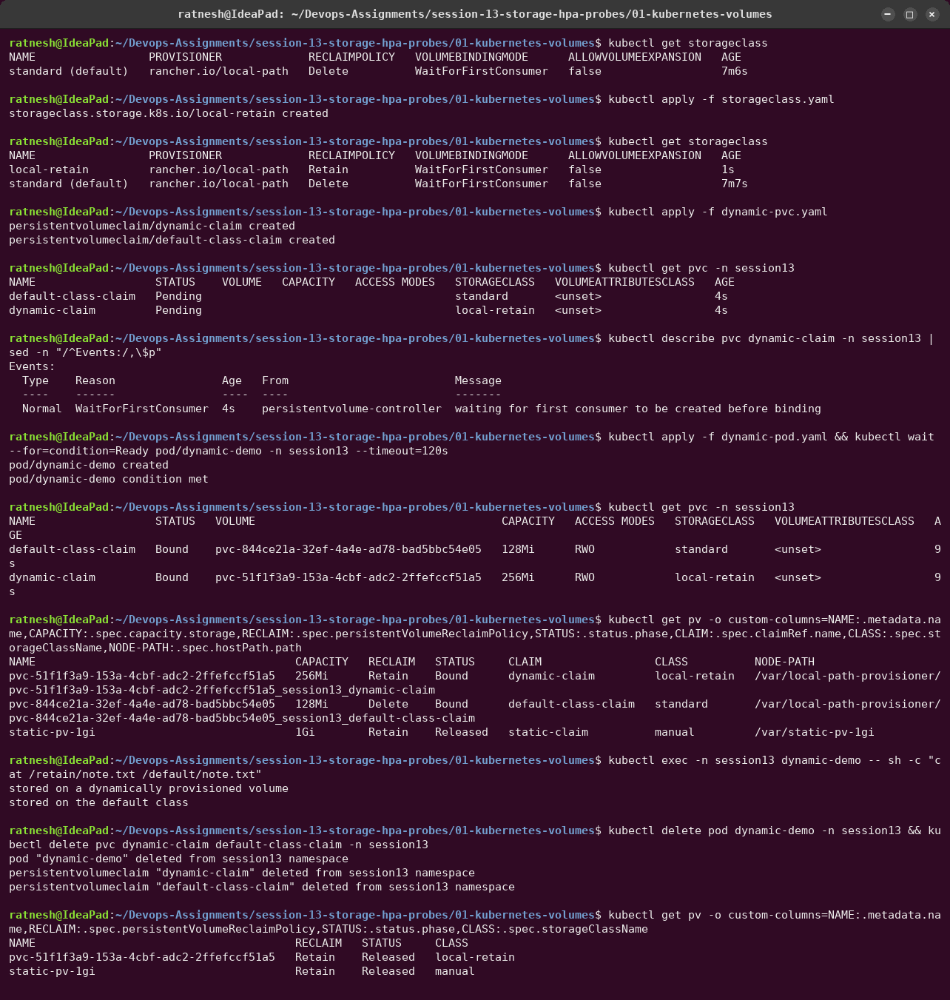
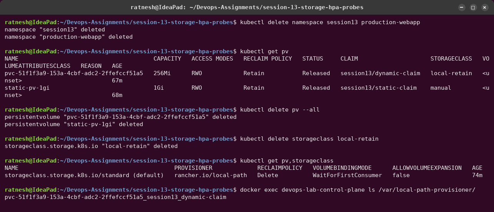

# 01 — Kubernetes Volumes

A container's filesystem is thrown away every time the container restarts. Volumes are how
Kubernetes gives a Pod storage that lives longer than a single container — and, with
PersistentVolumes, longer than the Pod itself.

Everything below was run on my laptop against the `devops-lab` kind cluster
(Kubernetes v1.37.0, single node). All manifests are in this folder.

```text
                         lifetime of the data
  container fs  ──► dies with the container
  emptyDir      ──► dies with the Pod              (shared by all containers in the Pod)
  hostPath      ──► lives on one node              (survives Pod deletion, tied to that node)
  PV / PVC      ──► lives until the PV is deleted  (independent of Pods, follows reclaim policy)
```

---

## emptyDir

**What it is.** An empty directory created when the Pod is scheduled onto a node. Every
container in the Pod can mount it (at different paths if you like). It survives container
restarts, but it is deleted for good when the Pod is removed from the node.

**When to use it.** Scratch space, caches, and handing files between containers of the same
Pod (a sidecar reading what the main container writes). `medium: Memory` backs it with tmpfs;
`sizeLimit` caps it.

```yaml
volumes:
  - name: shared-cache
    emptyDir:
      sizeLimit: 50Mi
```

**Hands-on** — [`emptydir-pod.yaml`](emptydir-pod.yaml): a `writer` container appends a
line every 5 s to `/cache/log.txt`; a `reader` container mounts the same volume read-only at
`/shared`.



What the output shows:

- The reader sees the writer's lines at a *different* path — it is one volume, two mounts.
- The read-only mount is enforced: `can't create /shared/x.txt: Read-only file system`.
- On the node the volume is a plain directory under
  `/var/lib/kubelet/pods/<pod-uid>/volumes/kubernetes.io~empty-dir/shared-cache`. It is keyed
  by the Pod's UID, which is why it cannot outlive the Pod.
- After `kubectl delete pod` and re-creating it, the log starts again from one line: the old
  data is gone.

---

## hostPath

**What it is.** Mounts a file or directory from the node's own filesystem into the Pod.
`type: DirectoryOrCreate` creates it if missing.

**When to use it.** Node-level agents (log collectors, monitoring DaemonSets that read
`/var/log` or `/proc`). It is avoided for applications because:

- the data is tied to one node — a Pod rescheduled elsewhere sees an empty directory;
- it gives the Pod access to the host filesystem, which is a security risk (Pod Security
  Standards *baseline/restricted* forbid it).

**Hands-on** — [`hostpath-pod.yaml`](hostpath-pod.yaml) appends a line to
`/host-data/visits.txt`, which is `/var/session13-hostpath` on the node.



The kind "node" is a Docker container, so `docker exec devops-lab-control-plane cat ...`
reads the node's disk directly — the file is really on the host. After deleting and recreating
the Pod there are **two** lines: the data survived the Pod.

---

## PersistentVolume (PV)

**What it is.** A piece of storage in the cluster, represented as a cluster-scoped API object
(not namespaced). It records capacity, access modes, the backend (NFS, cloud disk, CSI
driver, hostPath...) and a **reclaim policy**:

| Reclaim policy | What happens when the claim is deleted |
|---|---|
| `Retain` | PV becomes `Released`; data is kept; an admin must clean up or reuse it |
| `Delete` | PV *and* the underlying storage are deleted (the default for dynamic provisioning) |
| `Recycle` | deprecated |

**Access modes:** `ReadWriteOnce` (one node), `ReadOnlyMany`, `ReadWriteMany` (many nodes),
`ReadWriteOncePod` (exactly one Pod).

[`static-pv.yaml`](static-pv.yaml) — a 1 Gi `Retain` PV with `storageClassName: manual`.

## PersistentVolumeClaim (PVC)

**What it is.** A namespaced *request* for storage: "I need 500 Mi, ReadWriteOnce, class
`manual`". Kubernetes binds the claim to a PV that satisfies it, and Pods mount the claim — so
the application never needs to know where the storage physically lives.

```text
Pod ──mounts──► PVC (namespace, request) ──bound to──► PV (cluster, actual storage)
```

**Hands-on (static provisioning)** — [`static-pvc.yaml`](static-pvc.yaml) +
[`pvc-pod.yaml`](pvc-pod.yaml).



Observations:

1. The PV starts `Available`; once the claim exists both become `Bound` to each other.
2. The claim asked for **500Mi but its capacity shows 1Gi** — a claim binds to a whole PV, it
   cannot take half of one.
3. `/data/owner.txt` survives deleting and recreating the Pod — the data lives in the PV.
4. `Used By: pvc-demo` in `describe pvc` shows which Pod mounts the claim.
5. Deleting the claim moves the `Retain` PV to `Released`, and the file is still on the node.
   A `Released` PV is not handed to a new claim automatically (its `claimRef` still points at
   the old one); an admin decides what to do with the data.

---

## StorageClass

**What it is.** A template that describes *how* to create volumes on demand: which
**provisioner** (CSI driver) to call, its parameters (disk type, IOPS...), the reclaim policy,
whether volumes can be expanded, and the **volume binding mode**:

- `Immediate` — provision as soon as the PVC is created.
- `WaitForFirstConsumer` — wait until a Pod that uses the PVC is scheduled, so the volume is
  created in the right zone/node for that Pod.

One class can be marked default (`storageclass.kubernetes.io/is-default-class: "true"`); a PVC
without `storageClassName` uses it. kind ships `standard`, backed by Rancher's
*local-path-provisioner*. Cloud examples: `gp3` with `ebs.csi.aws.com` on EKS,
`pd-balanced` with `pd.csi.storage.gke.io` on GKE.

[`storageclass.yaml`](storageclass.yaml) defines `local-retain`: same provisioner as
`standard`, but `reclaimPolicy: Retain`.

## Dynamic provisioning

**What it is.** No admin pre-creates PVs. When a PVC names a StorageClass, the class's
provisioner creates a matching PV automatically and binds it.

```text
PVC (class: local-retain) ──► provisioner rancher.io/local-path ──► new PV pvc-<uid> ──► Bound
```

**Hands-on** — [`dynamic-pvc.yaml`](dynamic-pvc.yaml) creates two claims (one on
`local-retain`, one on the default class) and [`dynamic-pod.yaml`](dynamic-pod.yaml) mounts
both.



Observations:

1. Both claims sit in `Pending` with the event `WaitForFirstConsumer` — nothing is created
   until a Pod needs the storage.
2. As soon as the Pod is scheduled, two PVs named `pvc-<uid>` appear, created by the
   provisioner, with the exact requested sizes (256Mi and 128Mi), each a directory under
   `/var/local-path-provisioner/` on the node.
3. After deleting the claims, the `standard` volume (**Delete**) disappears completely,
   while the `local-retain` volume (**Retain**) stays as `Released` — the reclaim policy of
   the class decides what happens to the data.

---

## Summary

| | emptyDir | hostPath | PV + PVC (static) | StorageClass (dynamic) |
|---|---|---|---|---|
| Created by | kubelet, per Pod | already on the node | admin creates PV | provisioner, on demand |
| Lifetime | the Pod | the node | the PV (reclaim policy) | the PV (class's reclaim policy) |
| Survives Pod deletion | no | yes, same node only | yes | yes |
| Portable across nodes | — | no | depends on backend | depends on backend |
| Typical use | scratch, sidecars | node agents | pre-provisioned disks / NFS | almost all stateful apps |

## Cleanup — and one more Retain lesson



Deleting the `Retain` PV *object* does not delete the data. The provisioner never removes it,
so the `pvc-51f1f3a9..._session13_dynamic-claim` directory is still on the node afterwards.
With `Retain`, cleaning the backing storage (a directory here, an EBS volume in AWS) is a
manual job. That is the point of the policy, and also how orphaned cloud disks pile up.
