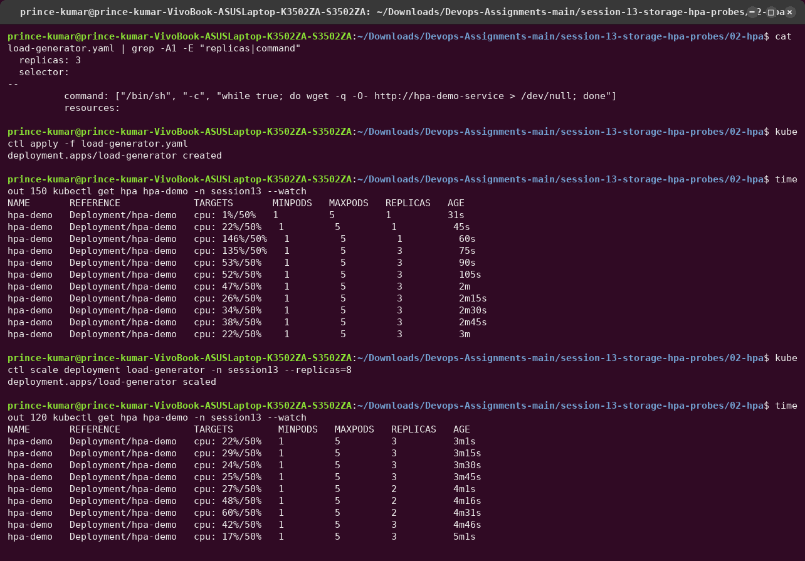
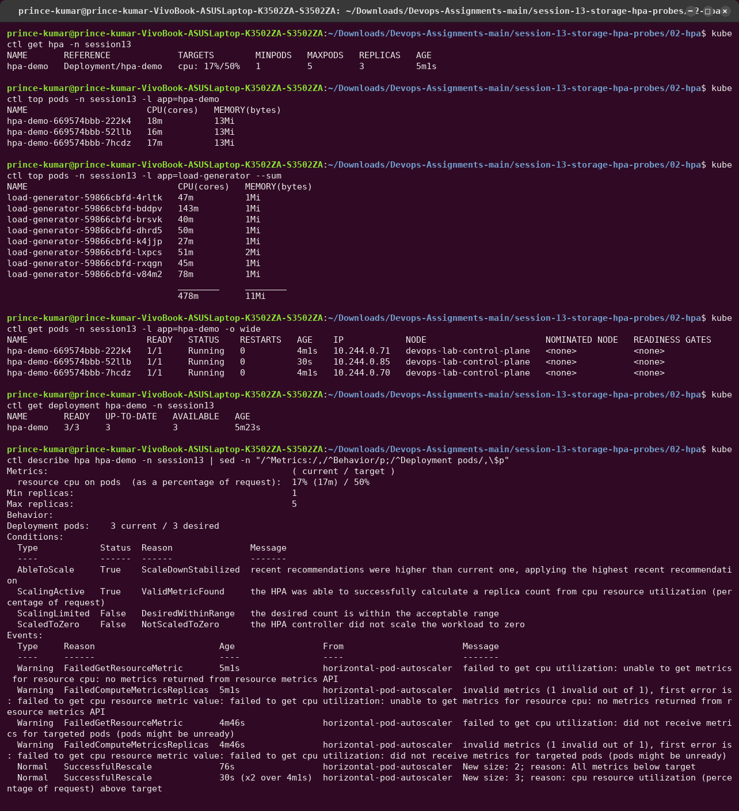
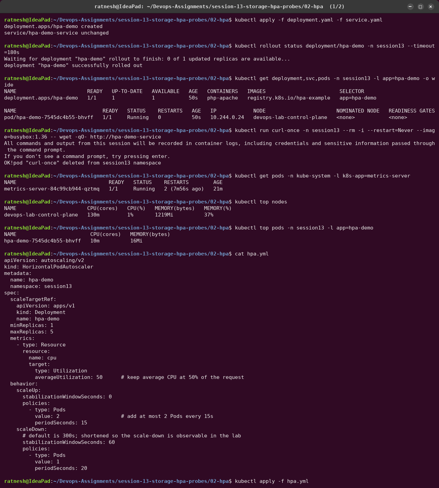
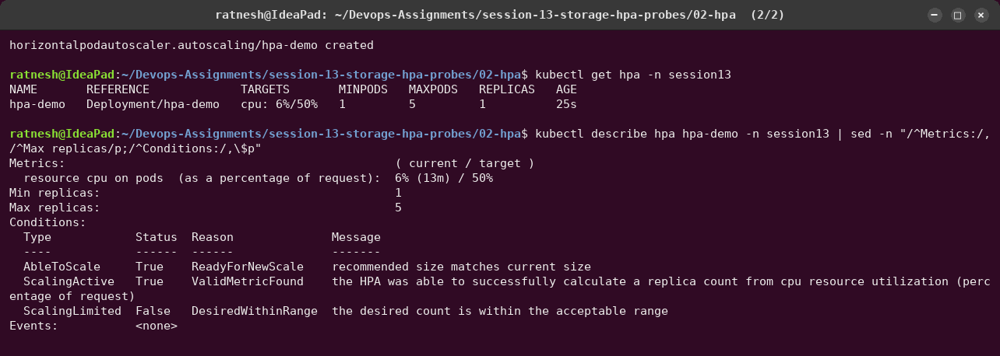
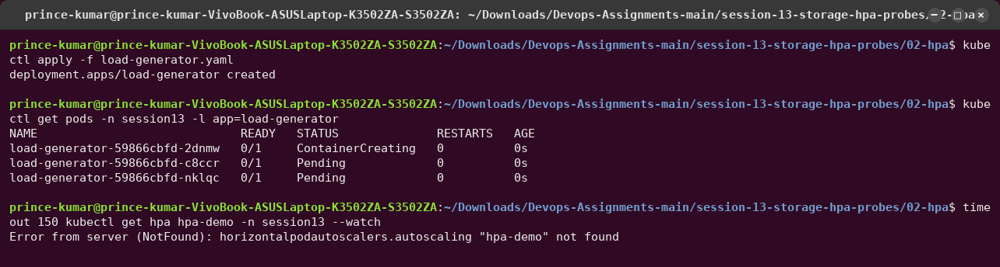
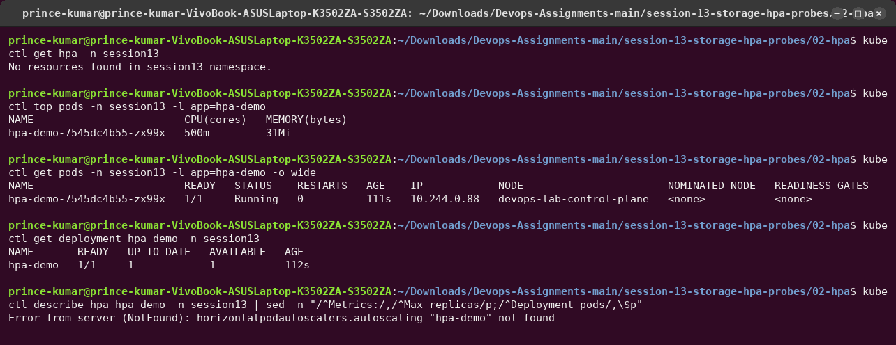
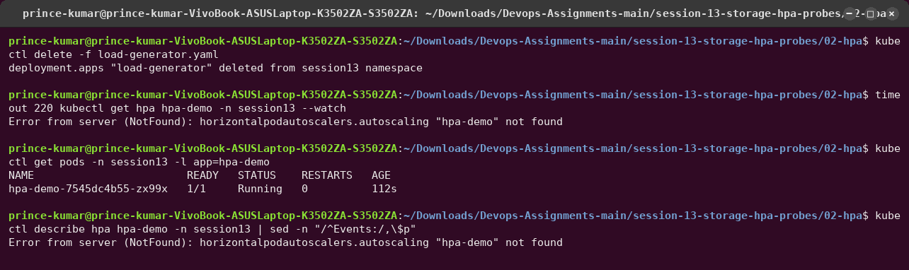

# 02 — HPA Hands-on

The **Horizontal Pod Autoscaler** watches a metric (here: average CPU as a percentage of each
Pod's CPU *request*) and changes the `replicas` of a Deployment to keep that metric near a
target.

```text
load ─► Pods use CPU ─► kubelet/cAdvisor ─► metrics-server ─► HPA controller (every 15s)
                                                                   │
            desiredReplicas = ceil( currentReplicas × currentUtilisation / targetUtilisation )
                                                                   │
                                                                   ▼
                                                     Deployment .spec.replicas
```

| File | Purpose |
|---|---|
| [`deployment.yaml`](deployment.yaml) | `hpa-demo` Deployment, 1 replica, CPU request 200m / limit 500m |
| [`service.yaml`](service.yaml) | `hpa-demo-service` ClusterIP |
| [`hpa.yml`](hpa.yml) | HPA: min 1, max 5, target 50 % CPU, custom scale-up/scale-down behaviour |
| [`load-generator.yaml`](load-generator.yaml) | 3 busybox Pods calling the Service in a tight loop |
| [`nginx-attempt/`](nginx-attempt/) | the first version of the Deployment (static nginx), kept for comparison |

Prerequisite: **metrics-server**. kind does not ship it, so the lab setup script
([`utility/cluster/setup.sh`](../../utility/cluster/setup.sh)) installs v0.9.0 with
`--kubelet-insecure-tls` (kind's kubelets use self-signed serving certificates).

---

## Attempt 1 — the image would not pull (Docker Hub 429)

The very first `kubectl apply` produced a Pod stuck in `ErrImagePull` → `ImagePullBackOff`, and
the HPA showed `cpu: <unknown>/50%` with `FailedGetResourceMetric`.


- **Symptom:** HPA `TARGETS <unknown>`; `kubectl top pods` → "Metrics not available".
- **Investigation:** `kubectl describe pod` events →
  `429 Too Many Requests` from `registry-1.docker.io`.
- **Root cause:** Docker Hub's anonymous pull limit. My network shares one public IP, and
  the limit (100 pulls / hour) was already used up. With no running container there are
  no CPU metrics, so the HPA cannot compute anything. The HPA was not broken. It had no input.
- **Fix:** pull Docker Hub images through Google's public mirror `mirror.gcr.io`: a
  containerd `hosts.toml` on the kind node, and `registry-mirrors` in Docker Desktop's
  engine config. Both are in [`utility/cluster/setup.sh`](../../utility/cluster/setup.sh).
  After that the Pod started in under a second.

## Attempt 2 — nginx is too cheap to autoscale

The course's `hpa.yaml` targets an nginx Deployment. It deployed fine, but even with the load
generator scaled to **8** Pods, nginx serving a static page used only ~30m CPU per Pod. The
HPA scaled to 4, then correctly scaled *back down*, because CPU (not request count) is what
it measures.




Lesson: the HPA can only scale on a metric that really tracks load. For a cheap static
server you would scale on requests-per-second through a custom/external metric, not CPU. To
demonstrate CPU-based scaling, the Deployment now runs **`registry.k8s.io/hpa-example`**, the
CPU-bound PHP app used in the official Kubernetes HPA walkthrough: every request runs a
compute loop.

---

## Final run

### 1–3. Deploy the application, configure the HPA, verify it

```bash
kubectl apply -f deployment.yaml -f service.yaml
kubectl rollout status deployment/hpa-demo -n session13
kubectl top nodes && kubectl top pods -n session13 -l app=hpa-demo
kubectl apply -f hpa.yml
kubectl get hpa -n session13
kubectl describe hpa hpa-demo -n session13
```




`TARGETS cpu: 6%/50%` and `ScalingActive True / ValidMetricFound` confirm that the HPA is
receiving metrics. Idle, the Pod uses 13m of its 200m request.

### 4–7. Load generator → CPU rises → Pods scale out

```bash
kubectl apply -f load-generator.yaml
kubectl get hpa hpa-demo -n session13 --watch
```



| Time (HPA age) | CPU vs target | Replicas | What happened |
|---|---|---|---|
| 32s | 7 % | 1 | idle |
| 45s | 115 % | 1 | load arrives; metrics lag one scrape |
| 60s | 208 % | **3** | `ceil(1 × 208/50) = 5`, but `scaleUp` policy allows +2 Pods per 15 s |
| 75s | 173 % | **5** | second step — reaches `maxReplicas` |
| 90s → 3m | ~125–135 % | 5 | capped: wants more than 5 |



`ScalingLimited True — TooManyReplicas` is the HPA saying "I would add more, but
`maxReplicas: 5` stops me". Each Pod sits around 250–300m, above its 200m request, which is
allowed because its limit is 500m.

### 8. Stop the load → scale down

```bash
kubectl delete -f load-generator.yaml
kubectl get hpa hpa-demo -n session13 --watch
```



CPU falls to 6 % within ~30 s, but replicas do not drop at once. The `behavior.scaleDown`
block in `hpa.yml` sets a **60 s stabilisation window** (default is 300 s), so the HPA waits
until a minute of low readings agree, and then removes at most **1 Pod per 20 s**. The events
show `New size: 4 → 3 → 2 → 1; reason: All metrics below target`. Scaling up fast and down
slowly avoids "flapping" when traffic is spiky.

---

## Useful commands

```bash
kubectl get hpa -n session13              # current vs target, replicas
kubectl get hpa -n session13 --watch      # live changes
kubectl describe hpa hpa-demo -n session13  # conditions + SuccessfulRescale events
kubectl top pods -n session13             # per-pod CPU/memory from metrics-server
kubectl top nodes
kubectl get pods -n session13 -l app=hpa-demo -o wide
```

## Key points

- HPA needs **resource requests**: utilisation = usage ÷ request. With no `requests.cpu` the
  HPA shows `<unknown>`.
- HPA needs a **metrics pipeline** (metrics-server for CPU/memory; Prometheus Adapter or KEDA
  for custom metrics).
- The metric must actually **track load** — nginx serving a static page did not.
- `minReplicas`/`maxReplicas` bound the result; `behavior` controls how fast it moves in
  each direction.
