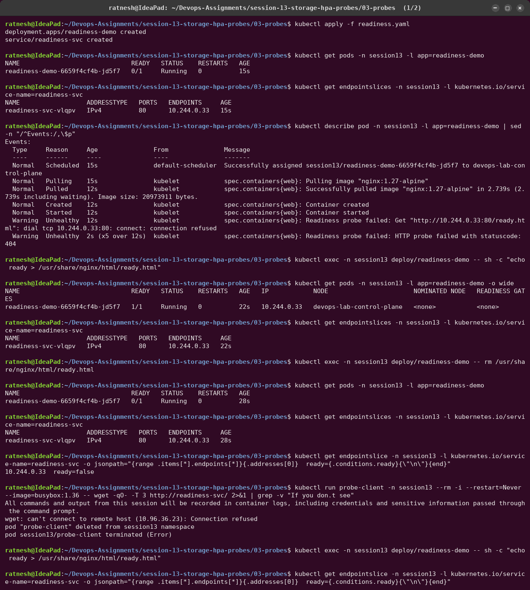
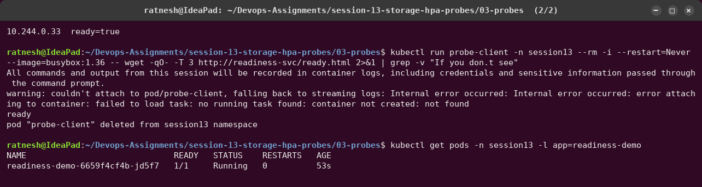
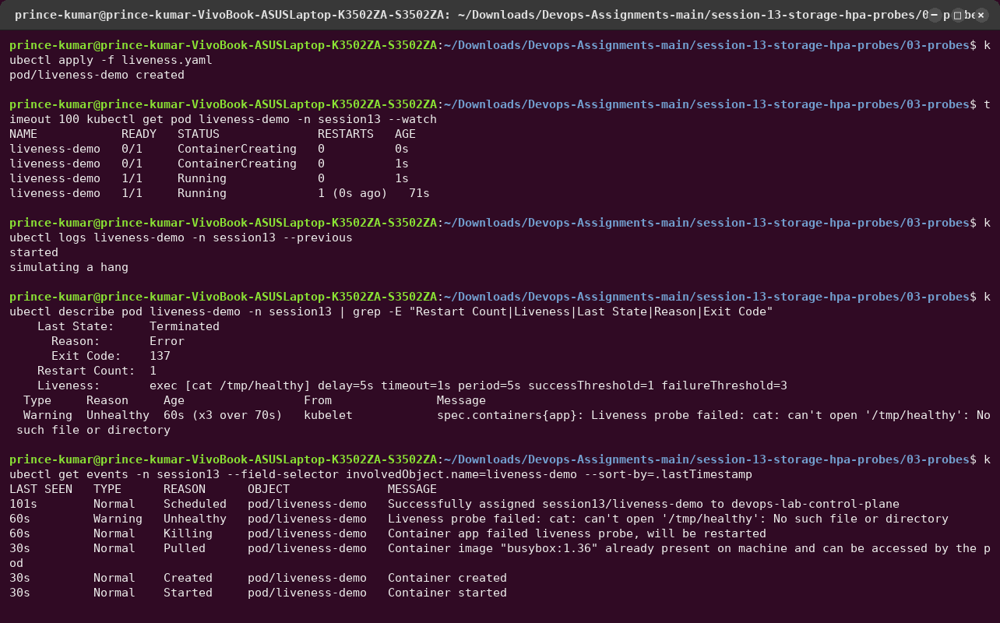
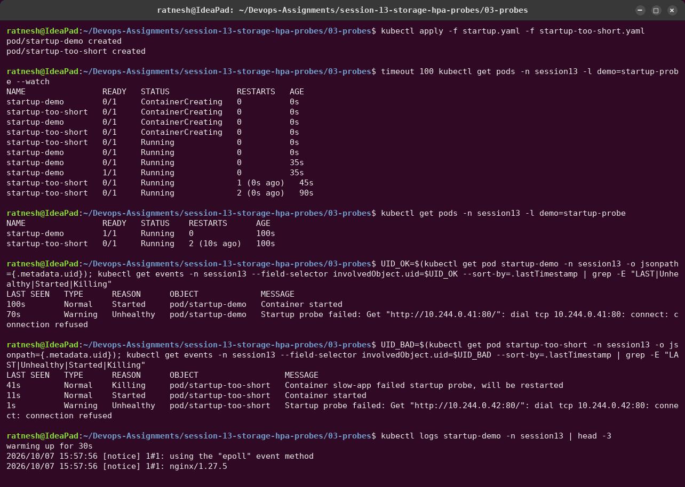

# 03 — Probes

The kubelet runs probes against every container and acts on the result. Three probes, three
different questions:

| Probe | Question | On failure | Typical check |
|---|---|---|---|
| **startup** | Has the app finished booting? | container restarted once `failureThreshold × periodSeconds` is used up; until it passes, liveness/readiness are **not run** | same endpoint as liveness, with a generous budget |
| **readiness** | Can this Pod take traffic *right now*? | Pod marked `NotReady` → removed from Service endpoints. **No restart.** | `/ready`: dependencies (DB, cache) reachable |
| **liveness** | Is the process still healthy, or hung? | container **killed and restarted** | `/health`: cheap "am I alive" check |

Probe mechanisms: `httpGet` (2xx/3xx = success), `tcpSocket`, `exec` (exit code 0) and `grpc`.
Timing fields: `initialDelaySeconds`, `periodSeconds`, `timeoutSeconds`, `failureThreshold`,
`successThreshold`.

---

## Readiness — [`readiness.yaml`](readiness.yaml)

nginx is up, but the probe asks for `/ready.html`, which does not exist yet.




- `Running` but `0/1` — the container runs, the Pod is just not *ready*. The events show
  `connection refused` (nginx still starting), then `HTTP probe failed with statuscode: 404`.
- Creating the file → `1/1`; deleting it → back to `0/1`. **RESTARTS stays 0** the whole
  time: readiness never restarts anything.
- Note on EndpointSlices: the `ENDPOINTS` column keeps listing `10.244.0.33` even while the Pod
  is not ready. EndpointSlices keep not-ready endpoints but mark them `ready=false`; kube-proxy
  only routes to `ready=true` ones. The jsonpath query shows this. A request through the
  Service gets `Connection refused` while the only endpoint is not ready, and returns `ready`
  once it is.

## Liveness — [`liveness.yaml`](liveness.yaml)

The container creates `/tmp/healthy`, deletes it after 25 s and then "hangs".



- Probe failures start at ~30 s; after 3 failures (5 s apart) the kubelet decides to restart
  the container (`Killing ... failed liveness probe, will be restarted`).
- The restart shows up at **70 s**, not 40 s. The process is `sh` running `sleep`, which ignores
  SIGTERM, so the kubelet waits the full `terminationGracePeriodSeconds` (30 s) before
  SIGKILL. That is why the last state is **Exit Code 137** (128 + 9, SIGKILL).
- `kubectl logs --previous` shows the output of the container that was killed.

## Startup — [`startup.yaml`](startup.yaml) vs [`startup-too-short.yaml`](startup-too-short.yaml)

Both Pods boot slowly (30 s `sleep` before nginx listens).

- `startup-demo`: budget `12 × 5 s = 60 s`, plus an aggressive liveness probe
  (`failureThreshold: 1`).
- `startup-too-short`: budget `3 × 5 s = 15 s`.



- `startup-demo` turns `1/1` at **36 s** with **0 restarts**. The startup probe failed while
  the app was warming up, but that only counts against its 60 s budget, and the strict
  liveness probe did not run until startup succeeded.
- `startup-too-short` is restarted at **45 s** and **90 s** (`failed startup probe, will be
  restarted`) and never becomes ready. Its 15 s budget is shorter than the 30 s boot, so it
  is stuck in a restart loop. Without a startup probe, the same thing would happen with any
  liveness probe that is stricter than the boot time. That is the problem startup probes
  solve.

## Choosing values

```text
startupProbe budget  >  worst-case boot time         (e.g. 30 x 2s = 60s)
readinessProbe       →  fast (period 5s), checks dependencies, failureThreshold 2-3
livenessProbe        →  slow to give up (3+ failures), checks only the process itself
```

A liveness probe that checks the database is a classic mistake: a DB outage would restart
every Pod in a loop without fixing anything. Dependency checks belong in readiness.
