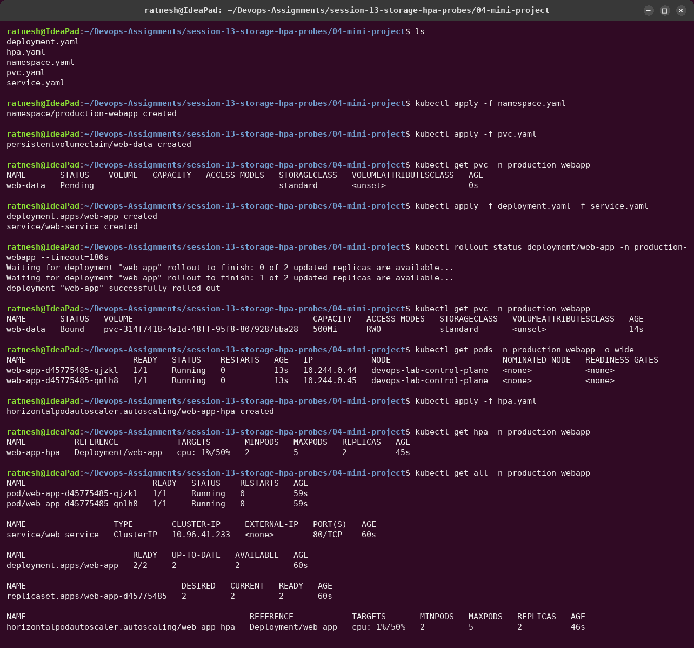
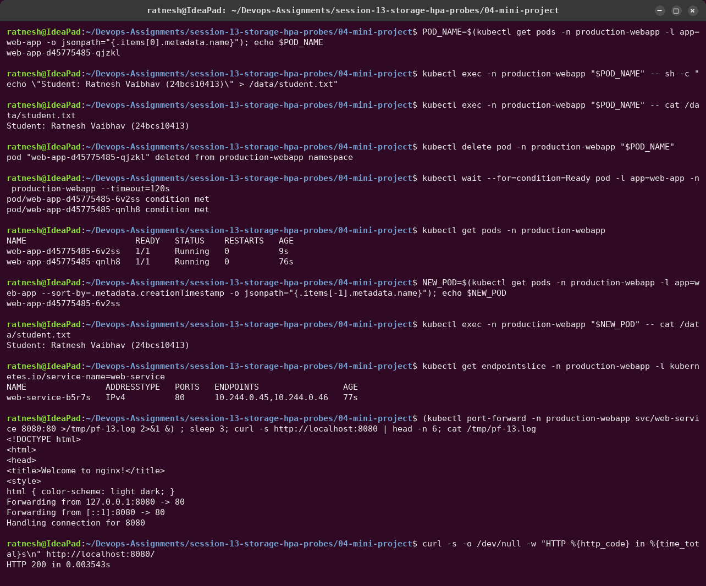
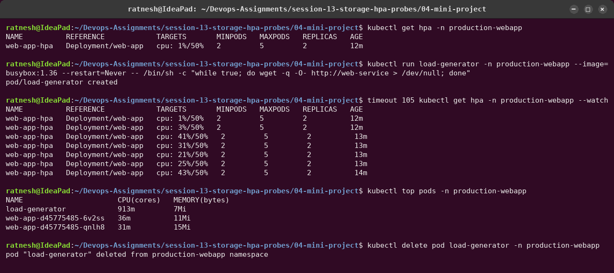
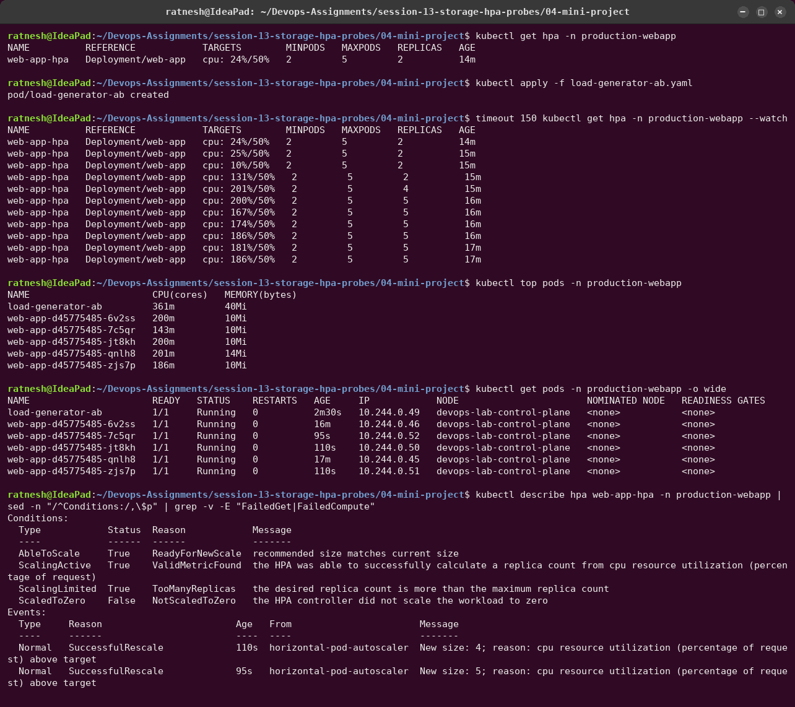
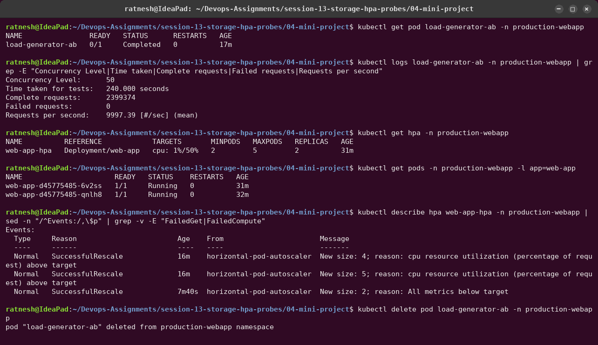
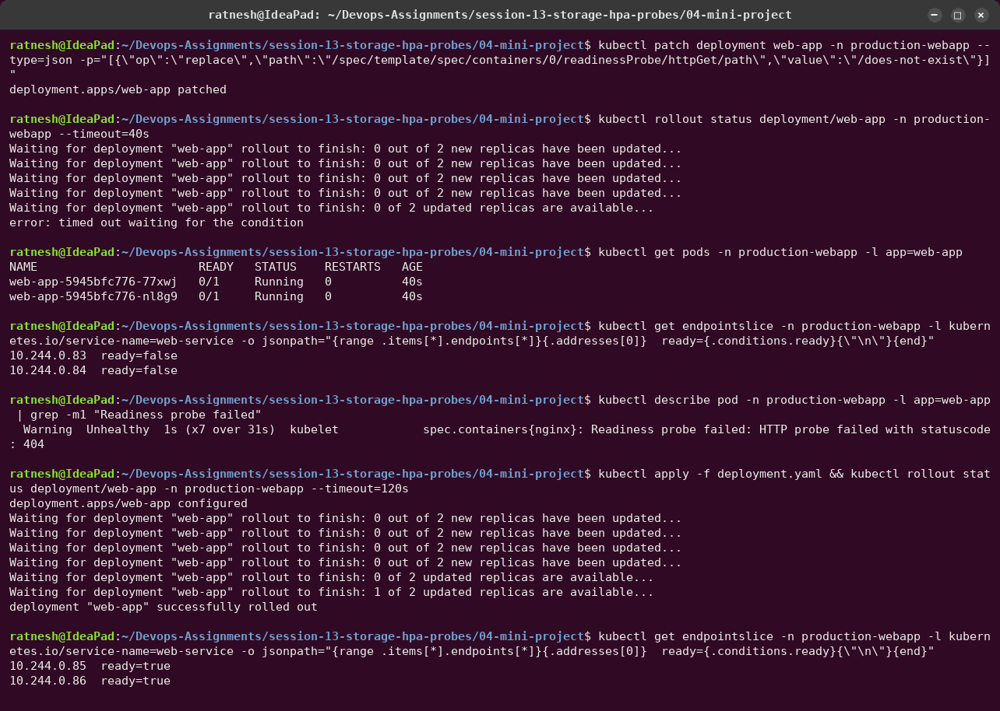
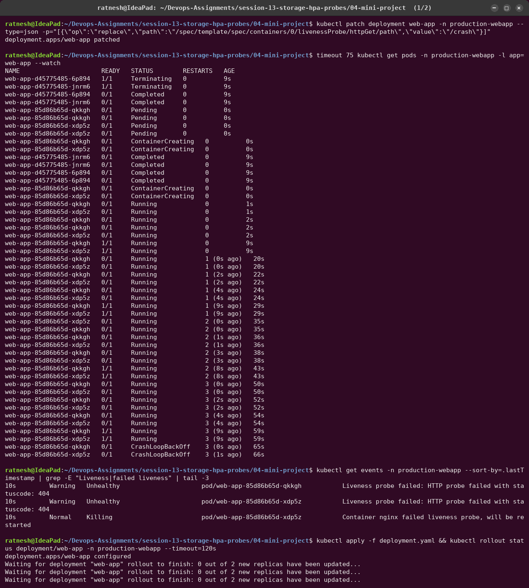
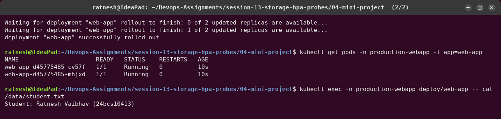

# 04 — Mini Project: Production-Ready Kubernetes Web App

A web app in its own namespace, built on the three topics of this session:

1. **State persistence**: a PersistentVolumeClaim mounted at `/data`, so data outlives Pods.
2. **Elastic scaling**: an HPA on CPU, 2 → 5 replicas.
3. **Health diagnostics**: startup, readiness and liveness probes on every Pod.

```text
                         [ Service: web-service :80 ]
                                     │
               ┌─────────────────────┼─────────────────────┐
               ▼                     ▼                     ▼
        [ web-app Pod 1 ]     [ web-app Pod 2 ]  ...  [ web-app Pod N ]
        startup/readiness/     startup/readiness/      startup/readiness/
        liveness probes        liveness probes         liveness probes
        requests cpu 100m      requests cpu 100m       requests cpu 100m
               │                     │                     │
               └──────── /data ──────┴──────── /data ──────┘
                                     │
                    PVC web-data (500Mi, RWO, class "standard")
                                     │
               local-path provisioner → /var/local-path-provisioner on the node

        metrics-server ──► HPA web-app-hpa (target 50% CPU, min 2, max 5) ──► Deployment
```

## Files

| File | What it creates |
|---|---|
| [`namespace.yaml`](namespace.yaml) | namespace `production-webapp` |
| [`pvc.yaml`](pvc.yaml) | PVC `web-data`, 500Mi, ReadWriteOnce, default StorageClass |
| [`deployment.yaml`](deployment.yaml) | `web-app`: 2 × nginx:1.27, CPU/memory requests and limits, all three probes, `/data` from the PVC, `Recreate` strategy |
| [`service.yaml`](service.yaml) | ClusterIP `web-service` on port 80 |
| [`hpa.yaml`](hpa.yaml) | `web-app-hpa`, min 2 / max 5 / 50 % CPU |
| [`load-generator-ab.yaml`](load-generator-ab.yaml) | ApacheBench load Pod (see Task 3) |

`Recreate` is deliberate: with a ReadWriteOnce volume, a rolling update would briefly need old
and new Pods to mount the volume together. On one node that happens to work, but on a
multi-node cluster the new Pod would hang in `ContainerCreating`.

---

## Deployment

```bash
kubectl apply -f namespace.yaml
kubectl apply -f pvc.yaml
kubectl apply -f deployment.yaml -f service.yaml
kubectl apply -f hpa.yaml
```



The PVC stays `Pending` until the Deployment's first Pod is scheduled (`standard` uses
`WaitForFirstConsumer`), then binds. Both Pods are `1/1 Running` and the HPA reads
`cpu: 1%/50%`.

## Task 1 — Storage persistence



1. Wrote `Student: Prince Kumar (24bcs10658)` into `/data/student.txt` from the first Pod.
2. Deleted that Pod. The Deployment replaced it with `web-app-...-6v2ss`.
3. The **new** Pod reads the same file. The data lives on the PersistentVolume, not in the
   container.

## Task 2 — Service verification

Same screenshot: the EndpointSlice lists both Pod IPs, and
`kubectl port-forward svc/web-service 8080:80` + `curl` returns the nginx welcome page with
`HTTP 200`.

## Task 3 — HPA elastic scaling

**With the README's busybox loop:** CPU peaked at **45 %**, below the 50 % target, so the HPA
correctly did nothing. One `wget` process per request cannot load nginx enough.



**With ApacheBench** (`ab -k -c 50`, 50 keep-alive connections for 240 s,
[`load-generator-ab.yaml`](load-generator-ab.yaml)):



- CPU jumps to ~200 % of the request; every nginx Pod is pinned at its **200m limit**.
- The HPA scales **2 → 4 → 5** and reports `ScalingLimited: TooManyReplicas`.

**Scale down:** when the load stopped, the HPA waited for the default **5-minute**
stabilisation window, then went straight back to `minReplicas`. This HPA has no `behavior`
block, so the default scale-down policy allows removing 100 % of the excess at once.



---

## Bonus challenges

**Challenge 2 — Readiness gating.** Readiness path changed to `/does-not-exist`:



The Pods are `Running` but `0/1`, and every endpoint is `ready=false`, so the Service would
send traffic nowhere. No restarts. Re-applying `deployment.yaml` restores it.

**Challenge 3 — Liveness restart loop.** Liveness path changed to `/crash`:




nginx returns 404 for `/crash`. After 3 failures the kubelet kills the container. The restart
count climbs about every 15 s, and Kubernetes then backs off (`CrashLoopBackOff`). After
the fix, `/data/student.txt` is still there: storage survived several Pod generations.

---

## Probe reference

| Probe | Question | Action on failure |
|---|---|---|
| Startup | Has the process finished initialising? | restart container; other probes wait until it passes |
| Readiness | Can the Pod receive traffic now? | removed from Service endpoints; no restart |
| Liveness | Is the container alive and responsive? | container killed and restarted |

## Troubleshooting guide (hit or checked during this project)

| Symptom | Check | Root cause / fix |
|---|---|---|
| PVC `Pending` | `kubectl describe pvc web-data` | `WaitForFirstConsumer`: normal until a Pod uses it. Missing default class → `kubectl get sc` |
| HPA `TARGETS <unknown>` | `kubectl top pods -n production-webapp` | metrics-server missing, Pod not running yet, or no `requests.cpu` |
| HPA does not scale under load | `kubectl top pods` vs target | the load is too small to reach 50 % of the request (busybox loop) |
| `CrashLoopBackOff` | `kubectl describe pod`, events | liveness path or port wrong (Challenge 3) |
| Pods `Running` but `0/1` | `kubectl get endpointslice`, events | readiness path wrong (Challenge 2) |
