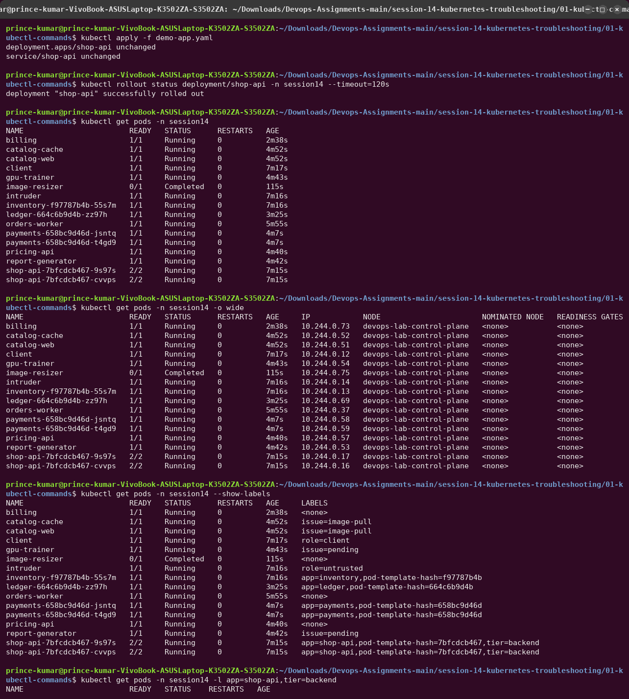
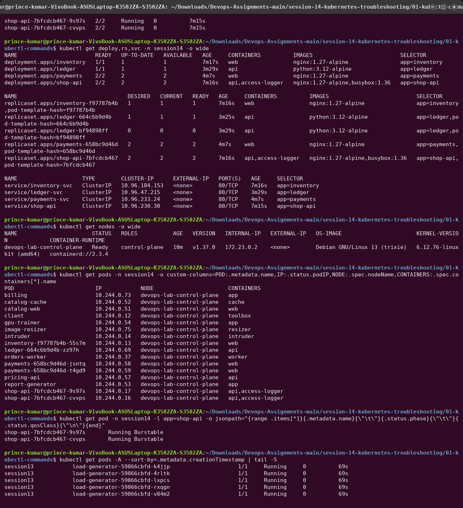
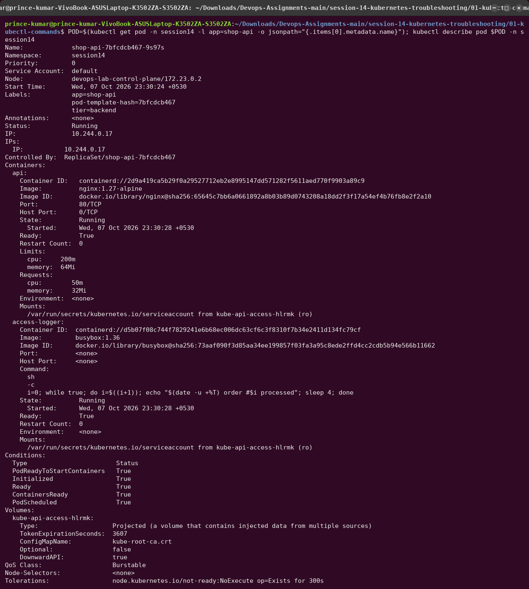
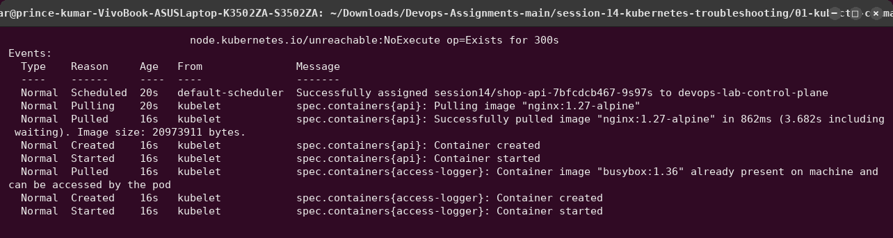
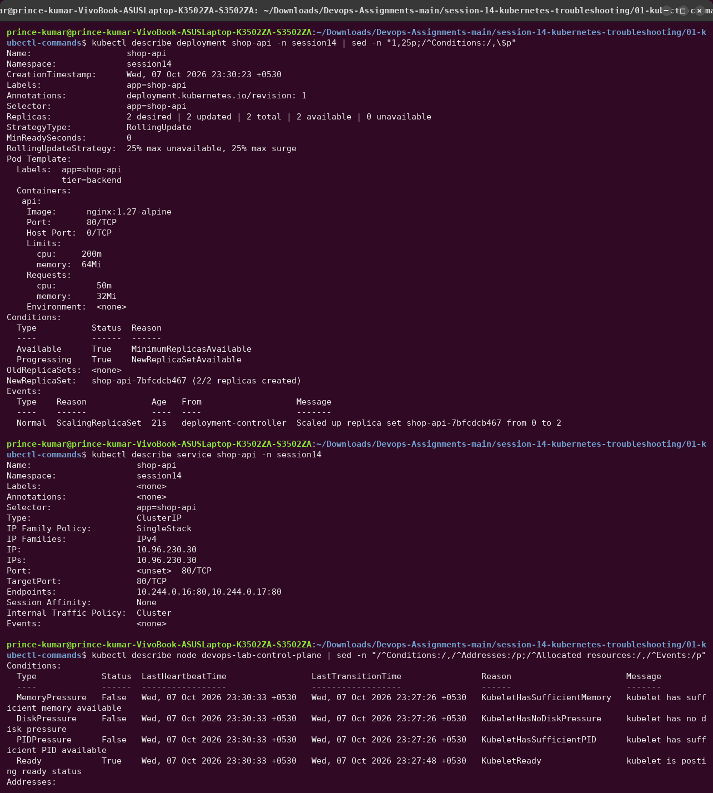
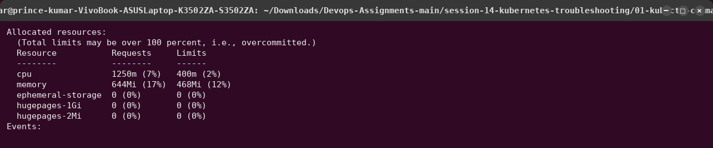
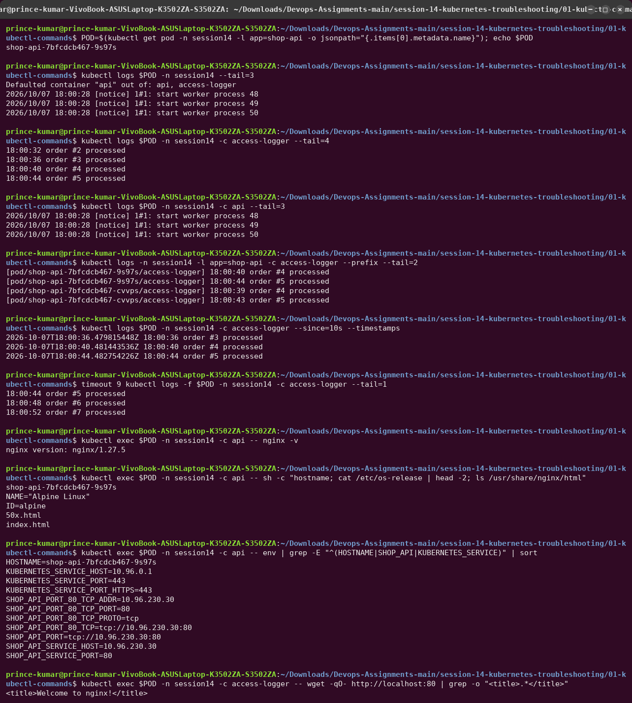
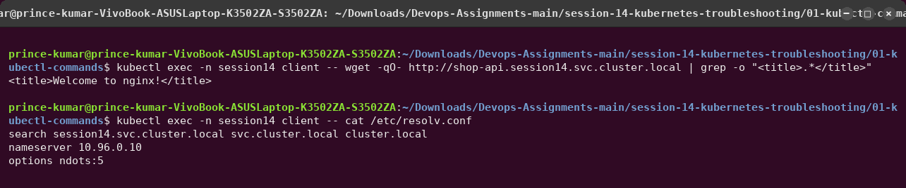
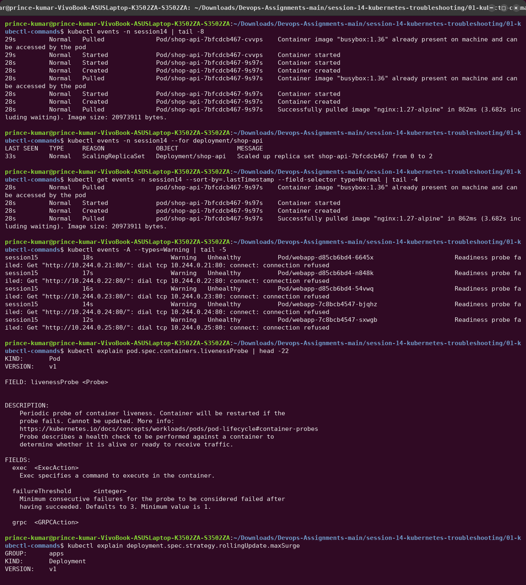
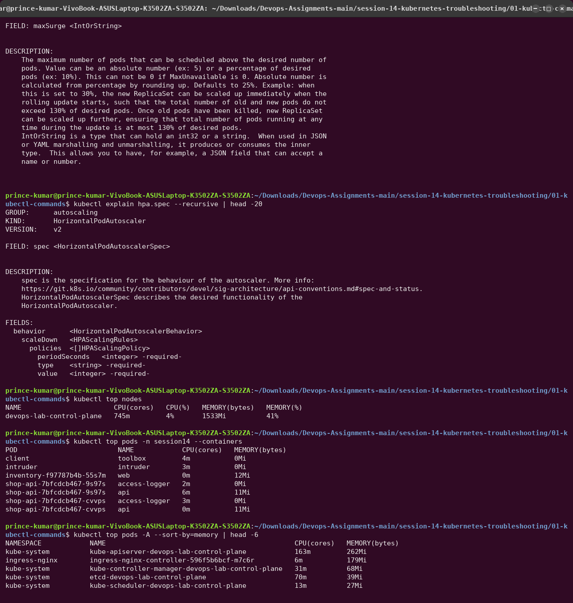

# 01 — Kubernetes Troubleshooting Commands

Practised against [`demo-app.yaml`](demo-app.yaml): a `shop-api` Deployment with 2 replicas
and **two containers per Pod** (`api` = nginx, `access-logger` = busybox printing an order log
every 4 s), plus a Service, plus the long-lived [`client`](../client-pod.yaml) toolbox Pod used
to test from inside the cluster.

| Command | Answers the question | Reach for it when |
|---|---|---|
| `kubectl get` | *What exists and what state is it in?* | always first |
| `kubectl get -o wide` | *Where is it running? What IP?* | networking/scheduling questions |
| `kubectl describe` | *Why is it in this state?* (spec + status + events) | anything not `Running`/`Ready` |
| `kubectl logs` | *What is the application saying?* | the container started but misbehaves |
| `kubectl exec` | *What does it look like from inside?* | config files, env, local connectivity |
| `kubectl events` | *What did Kubernetes try to do, and what failed?* | scheduling, pulling, mounting, probes |
| `kubectl explain` | *What does this field mean / what is allowed?* | writing or reviewing YAML |
| `kubectl top` | *How much CPU/memory is it using?* | OOMKills, throttling, HPA |

---

## `kubectl get` and `kubectl get -o wide`

- `READY 2/2`: both containers of each Pod are ready.
- `-o wide` adds Pod IP, node, nominated node and readiness gates; for Deployments and
  ReplicaSets it adds containers, images and the selector; for nodes it adds internal IP,
  OS image, kernel and container runtime (`containerd://2.3.4`).
- `--show-labels` and `-l app=shop-api,tier=backend` are how you check what a Service
  selector or a NetworkPolicy will match.
- `-o custom-columns` / `-o jsonpath` pull single fields, e.g. the QoS class (`Burstable`,
  since requests < limits).
- `--sort-by=.metadata.creationTimestamp` across `-A`: "what changed most recently?"

## `kubectl describe`

`describe pod` is the most useful single command. It shows `Controlled By: ReplicaSet/...`,
each container's **State / Last State / Restart Count / Exit Code**, requests and limits,
mounts, Pod **Conditions** (`PodScheduled`, `Initialized`, `ContainersReady`, `Ready`), and
the **Events** at the bottom.

- `describe deployment`: replicas (desired/updated/available), `RollingUpdateStrategy:
  25% max unavailable, 25% max surge`, `Available`/`Progressing` conditions, the new ReplicaSet.
- `describe service`: `Selector` and `Endpoints`, the two things to compare when a Service
  "does not work".
- `describe node`: `MemoryPressure`/`DiskPressure`/`PIDPressure`/`Ready` conditions and
  **Allocated resources** (sum of requests vs allocatable). This is what decides whether a
  Pod can be scheduled.

## `kubectl logs` and `kubectl exec`

- With several containers, `kubectl logs` picks the default one (`Defaulted container "api"`);
  `-c access-logger` selects the other.
- `-l app=shop-api --prefix` streams logs from every replica, prefixed with Pod/container.
- `--since=10s --timestamps`, `--tail=N` and `-f` (follow) narrow the output. `--previous`
  shows the last *crashed* container (used in the CrashLoopBackOff case).
- `kubectl exec <pod> -c <container> -- <cmd>` runs a command inside the container. The env
  shows the Service variables Kubernetes injects (`SHOP_API_SERVICE_HOST=10.96.230.30`).
- Containers in one Pod share a network namespace: `access-logger` reaches nginx on
  `localhost:80`.
- From the client Pod, `shop-api.session14.svc.cluster.local` works through cluster DNS
  (`nameserver 10.96.0.10`, `search session14.svc.cluster.local ...`).

## `kubectl events`, `kubectl explain`, `kubectl top`

- `kubectl events` (the newer subcommand) sorts by time by default; `--for deployment/shop-api`
  scopes to one object; `--types=Warning` shows only problems. The older form
  `kubectl get events --sort-by=.lastTimestamp --field-selector type=Normal` does the same.
- Events are kept for only **1 hour** by default. Look at them early.
- `kubectl explain pod.spec.containers.livenessProbe` is the API reference offline;
  `--recursive` prints the whole field tree (`hpa.spec` → `behavior.scaleDown.policies...`).
- `kubectl top` needs metrics-server. `--containers` splits per container, `--sort-by=memory`
  finds the biggest consumers. Here `kube-apiserver` is the largest at 262Mi.
