# 02 — Troubleshooting Common Issues

Each folder holds a deliberately broken manifest and its fix. Every case follows the same
six steps: **identify → investigate → root cause → fix → verify → document**. All of them ran
in the `session14` namespace (the DNS case also uses `storefront`). The "before" and "after"
screenshots are separate transcripts.

| # | Issue | Status seen | Root cause | Command that found it |
|---|---|---|---|---|
| 1 | [CrashLoopBackOff](#1-crashloopbackoff) | `Error` → `CrashLoopBackOff` | required env var missing → exit 1 | `kubectl logs` |
| 2 | [ErrImagePull / ImagePullBackOff](#2-errimagepull--imagepullbackoff) | `ErrImagePull` ⇄ `ImagePullBackOff` | tag does not exist; repository misspelt | `kubectl describe pod` events |
| 3 | [Pending](#3-pending) | `Pending`, no node | requests > node capacity; nodeSelector matches no node | `describe pod` → `FailedScheduling` |
| 4 | [ContainerCreating](#4-containercreating) | stuck `ContainerCreating` | mounted ConfigMap does not exist | `describe pod` → `FailedMount` |
| 5 | [Service connectivity](#5-service-connectivity) | Pods fine, Service refuses | selector typo **and** wrong targetPort | `get endpointslice`, `--show-labels`, `netstat` |
| 6 | [DNS](#6-dns) | `NXDOMAIN` | short name used across namespaces | `nslookup`, `/etc/resolv.conf` |
| 7a | [Pod networking (bind)](#7a-pod-networking--app-bound-to-127001) | Pod `Running`, peers refused | app listens on `127.0.0.1` | `netstat -tln` inside the Pod |
| 7b | [Pod networking (policy)](#7b-pod-networking--networkpolicy) | requests time out | default-deny NetworkPolicy | `get/describe networkpolicy` |
| 8 | [Configuration](#8-configuration-issues) | `CreateContainerConfigError` | wrong ConfigMap key; missing Secret | `describe pod` events |
| 9 | [OOMKilled](#9-bonus--oomkilled) | `OOMKilled`, exit 137 | memory limit below real usage | `describe pod` Last State |

---

## 1. CrashLoopBackOff

[`01-crashloopbackoff/`](01-crashloopbackoff/): `orders-worker` exits unless `DATABASE_URL` is set.

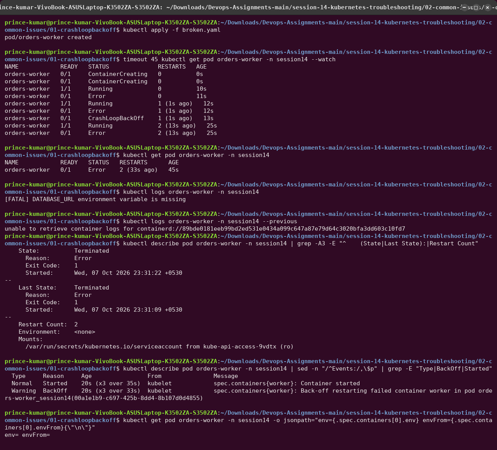

- **Identify:** `--watch` shows the cycle `Running → Error → CrashLoopBackOff` with the gaps
  growing (10 s, 20 s, 40 s ...). That is the kubelet's exponential back-off, capped at 5 min.
- **Investigate:** `describe` → `Last State: Terminated, Reason: Error, Exit Code: 1`,
  `Environment: <none>`, event `Back-off restarting failed container`.
- **Root cause:** `kubectl logs` → `[FATAL] DATABASE_URL environment variable is missing`.
  The app exits on purpose. Kubernetes keeps restarting it because `restartPolicy` is `Always`.
- Note: `--previous` failed with "unable to retrieve container logs". The pod was *in* `Error`,
  so the current container was already the dead one, and the kubelet had already
  garbage-collected the one before it. Plain `kubectl logs` showed the crash output.
- **Fix:** [`fixed.yaml`](01-crashloopbackoff/fixed.yaml) adds a ConfigMap and `envFrom`.

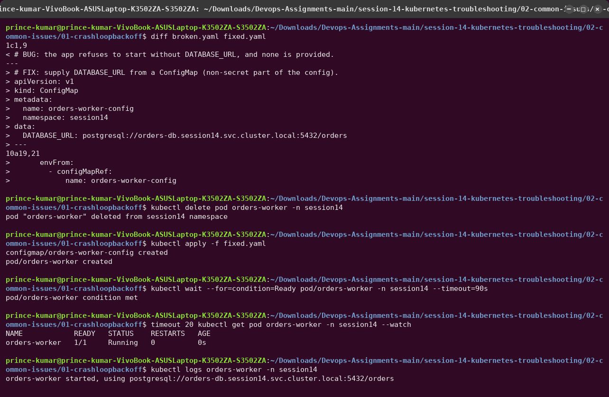

- **Verify:** `1/1 Running`, 0 restarts, log line `orders-worker started, using postgresql://...`.

## 2. ErrImagePull / ImagePullBackOff

[`02-imagepullbackoff/`](02-imagepullbackoff/): `catalog-web` uses tag
`1.27-alpine-doesnotexist`; `catalog-cache` uses repository `princekumar/redis-typo`.

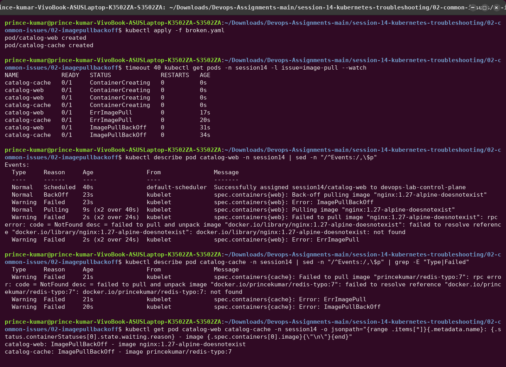

- **ErrImagePull** is one failed pull attempt; **ImagePullBackOff** is the kubelet waiting
  before the next attempt. The watch shows them alternating.
- **Root cause** from the events: `code = NotFound ... failed to resolve reference
  "docker.io/library/nginx:1.27-alpine-doesnotexist": not found`. The registry was reached,
  but the tag or repository does not exist. (Other causes look different: `401 Unauthorized` /
  `pull access denied` for a private image without `imagePullSecrets`,
  `429 Too Many Requests` for rate limiting, which hit me in Session 13, and
  `dial tcp ... i/o timeout` for network/DNS problems.)
- **Fix:** real tag `nginx:1.27-alpine` and the official `redis:7-alpine`.

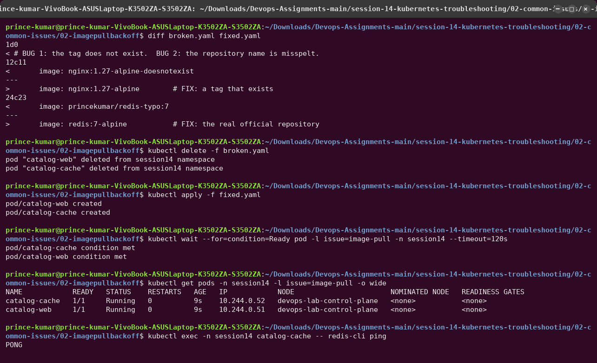

## 3. Pending

[`03-pending/`](03-pending/): `report-generator` requests 64 CPUs and 256 Gi;
`gpu-trainer` has `nodeSelector: accelerator=nvidia-a100`.

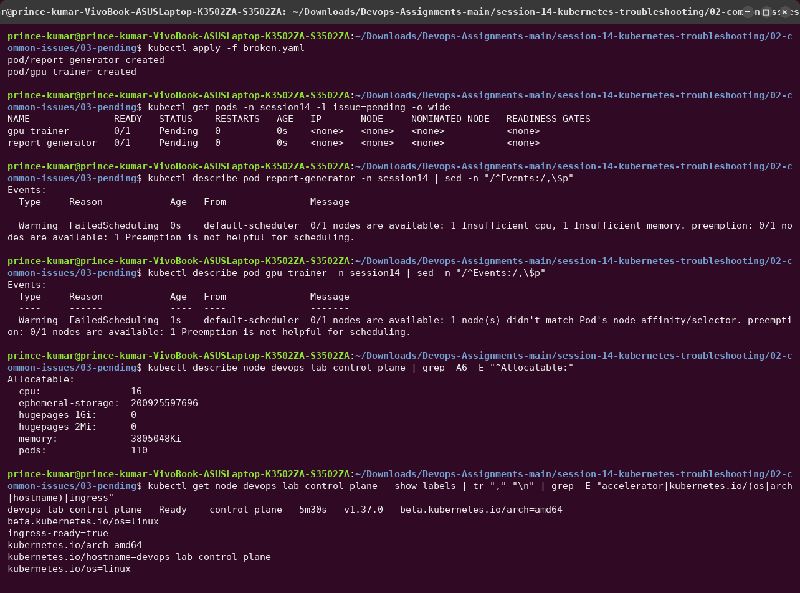

- `Pending` with `NODE <none>` means the **scheduler** could not place the Pod. Nothing on
  the node has happened yet.
- `FailedScheduling: 0/1 nodes are available: 1 Insufficient cpu, 1 Insufficient memory`.
  The node's **Allocatable** is 12 CPU / ~3.2 Gi.
- `FailedScheduling: ... didn't match Pod's node affinity/selector`. The node has no
  `accelerator` label.
- **Fix:** right-size the requests (100m / 64Mi). Pod resources cannot be edited in place
  here, so the Pod is recreated. For the selector, the real-world fix is to add a matching
  node (a GPU node pool). To simulate that, the node was labelled
  `accelerator=nvidia-a100`, and the label was removed again afterwards.

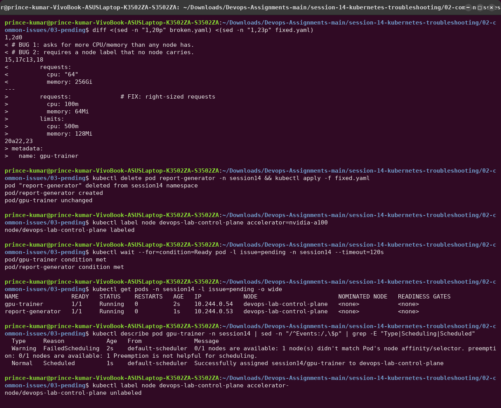

- **Verify:** both `Running`. `gpu-trainer` was **not** recreated: the scheduler retries
  Pending Pods and placed it one second after a matching node appeared
  (`FailedScheduling` → `Scheduled`).

## 4. ContainerCreating

[`04-containercreating/`](04-containercreating/): `pricing-api` mounts ConfigMap
`pricing-settings`, which does not exist.

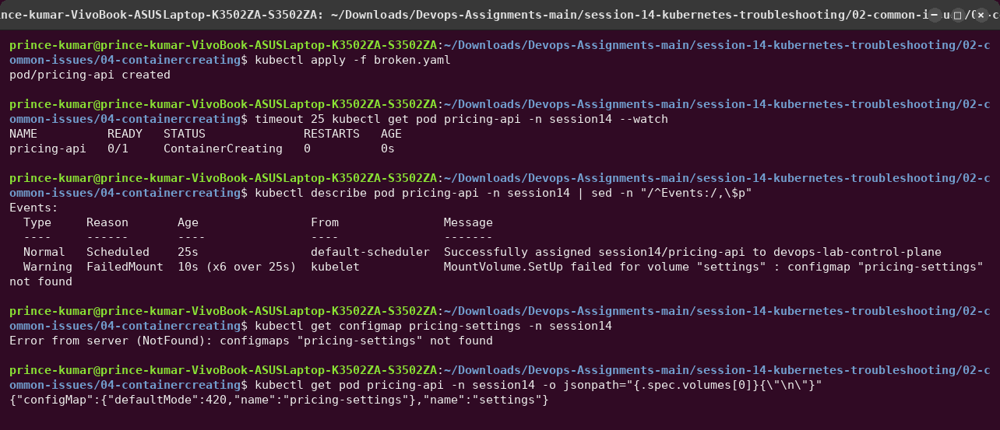

- `ContainerCreating` for more than a few seconds means the kubelet is stuck *before* starting
  the container: usually volumes (missing ConfigMap/Secret, PVC not bound, CSI attach
  failure), image pulls, or CNI not ready.
- Events: `FailedMount ... configmap "pricing-settings" not found`.
- **Fix:** create the ConfigMap ([`fix-configmap.yaml`](04-containercreating/fix-configmap.yaml)).

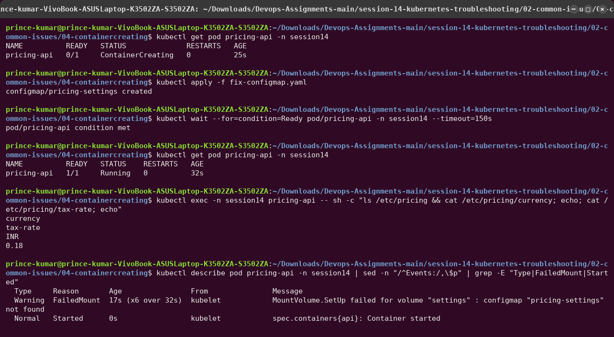

- **Verify:** the Pod became `1/1 Running` **without being recreated**. The kubelet retries
  mounts. `/etc/pricing/currency` = `INR`, `/etc/pricing/tax-rate` = `0.18`.

## 5. Service connectivity

[`05-service-connectivity/`](05-service-connectivity/): the `payments` Pods are healthy,
but [`broken-service.yaml`](05-service-connectivity/broken-service.yaml) has **two** bugs.

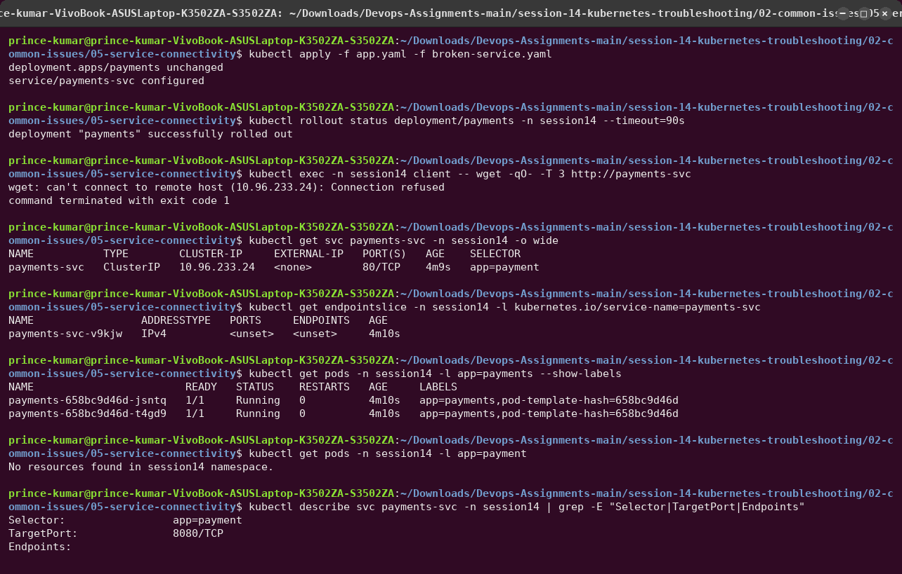

1. `wget http://payments-svc` → `Connection refused`. A Service with **no endpoints** gets
   rejected by kube-proxy.
2. `get endpointslice` → `ENDPOINTS <unset>`. `get pods --show-labels` shows `app=payments`;
   `-l app=payment` finds nothing; `describe svc` → `Selector: app=payment`. **Root cause 1:**
   selector typo.

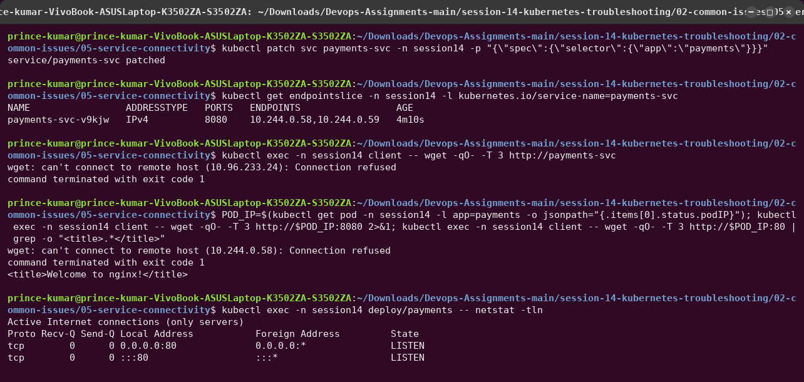

3. After patching the selector the endpoints appear, **but on port 8080**, and requests are
   still refused. Testing the Pod IP directly: `:8080` refused, `:80` works. `netstat -tln`
   inside the Pod: nginx listens on **80**. **Root cause 2:** `targetPort: 8080`.

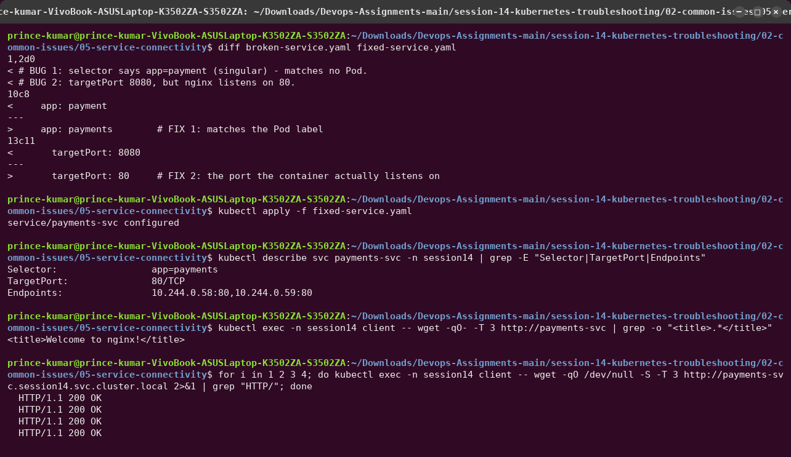

- **Verify:** `Endpoints: 10.244.0.78:80,10.244.0.79:80`, page loads, 4/4 `HTTP/1.1 200 OK`
  through the FQDN.
- Lesson: fixing the first bug changed the symptom only a little (still `refused`). Re-check
  every layer after a fix.

## 6. DNS

[`06-dns/`](06-dns/): `inventory-svc` lives in `session14`; the `frontend` Pod in namespace
`storefront` calls `http://inventory-svc`.

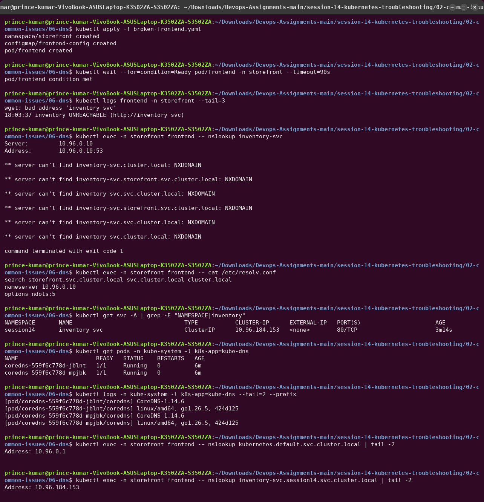

- **Identify:** the frontend logs `inventory UNREACHABLE (http://inventory-svc)`.
- **Investigate:** `nslookup inventory-svc` → `NXDOMAIN` for
  `inventory-svc.storefront.svc.cluster.local`, `...svc.cluster.local`, `...cluster.local`.
  The resolver tries every `search` domain from `/etc/resolv.conf`, and the first one is the
  **Pod's own** namespace.
- `kubectl get svc -A` → the Service exists, but in `session14`.
- CoreDNS is healthy: both Pods `Running`, and `kubernetes.default.svc.cluster.local` resolves.
  (The two `plugin/ready: Plugins not ready` lines are old CoreDNS start-up messages from when
  Docker Desktop was restarted earlier, not part of this problem.)
- The fully-qualified name `inventory-svc.session14.svc.cluster.local` resolves.
- **Root cause:** a short Service name only resolves inside its own namespace.
- **Fix:** [`fixed-frontend-config.yaml`](06-dns/fixed-frontend-config.yaml) uses the FQDN.

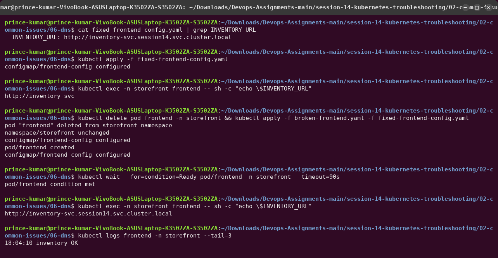

- Gotcha: after `kubectl apply` of the ConfigMap, the running Pod **still had the old value**.
  Environment variables from a ConfigMap are read only when the container starts. The Pod had
  to be recreated (with a Deployment: `kubectl rollout restart`). After that: `inventory OK`.

## 7a. Pod networking — app bound to 127.0.0.1

[`07-pod-networking/broken.yaml`](07-pod-networking/broken.yaml): `ledger` runs
`python3 -m http.server 8000 --bind 127.0.0.1`.

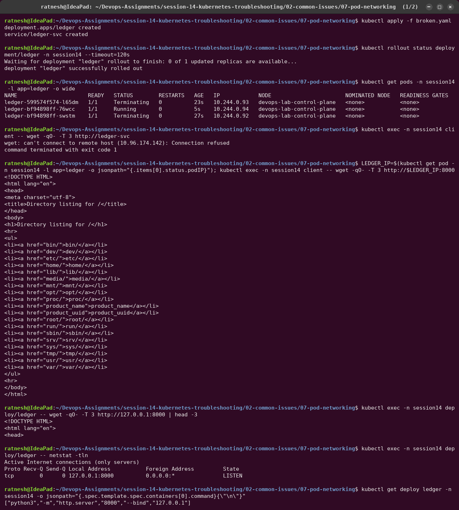
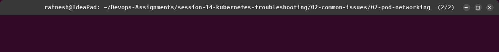

- The Pod is `1/1 Running`, yet both the Service and the Pod IP give `Connection refused`.
- Inside the Pod, `wget http://127.0.0.1:8000` works. `netstat -tln` shows
  `127.0.0.1:8000 LISTEN`: the socket accepts loopback only. Traffic from other Pods arrives
  on the Pod's `eth0` IP and is refused.
- **Fix:** `--bind 0.0.0.0` ([`fixed.yaml`](07-pod-networking/fixed.yaml)), plus a
  `tcpSocket` readiness probe. The kubelet probes the Pod IP, so this mistake would now show
  as `0/1` instead of hiding behind `Running`.

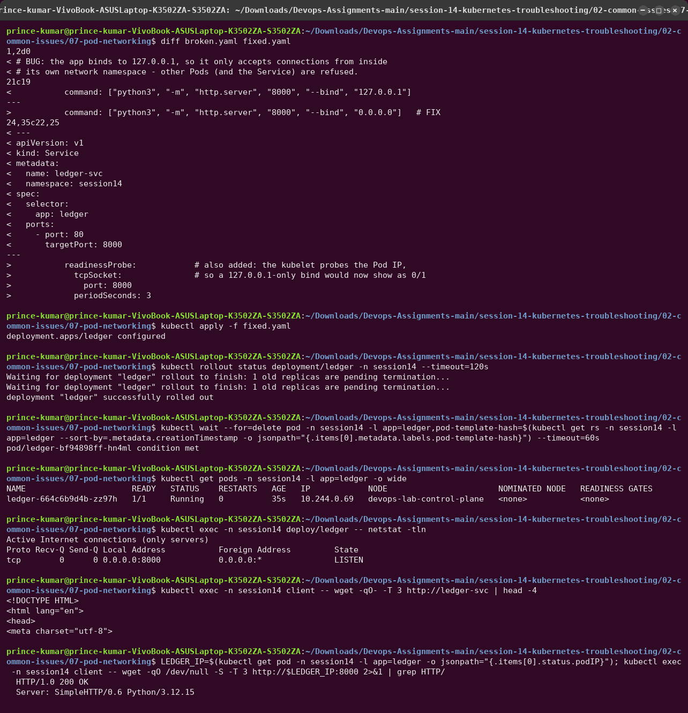

- The first verification after the fix still got `refused`. The old Pods were still
  `Terminating`: Python as PID 1 ignores SIGTERM, so each waited the full 30 s grace period,
  and kube-proxy can fall back to terminating endpoints. The recorded run waits for the old
  ReplicaSet's Pods to be gone (`kubectl wait --for=delete`) before testing.

## 7b. Pod networking — NetworkPolicy

The cluster's CNI (kindnet) enforces NetworkPolicy, so this is a real block, not a simulation.

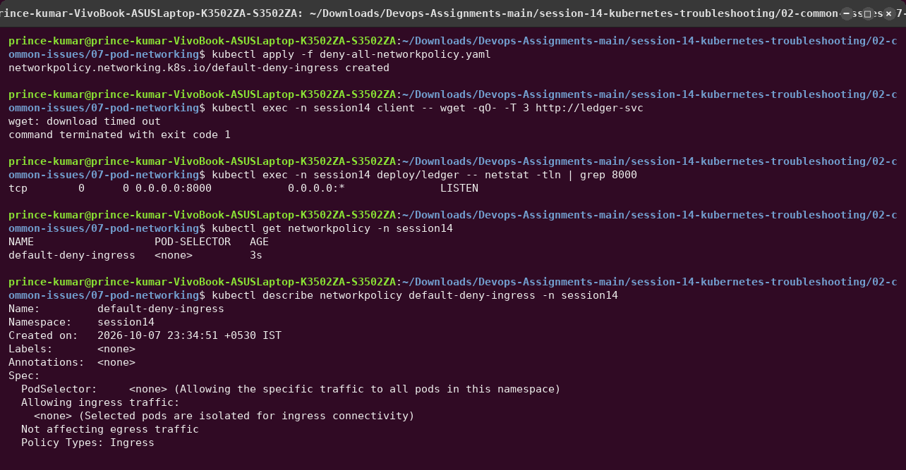

- Symptom differs from 7a: **`download timed out`**, not `refused`. Packets are dropped, not
  rejected. The app still listens on `0.0.0.0:8000`.
- `describe networkpolicy default-deny-ingress`: `PodSelector: <none>` (every Pod in the
  namespace), `Allowing ingress traffic: <none>`.
- **Fix:** keep default-deny and add a narrow allow rule
  ([`allow-client-networkpolicy.yaml`](07-pod-networking/allow-client-networkpolicy.yaml)):
  Pods labelled `role=client` may reach `app=ledger` on TCP 8000.

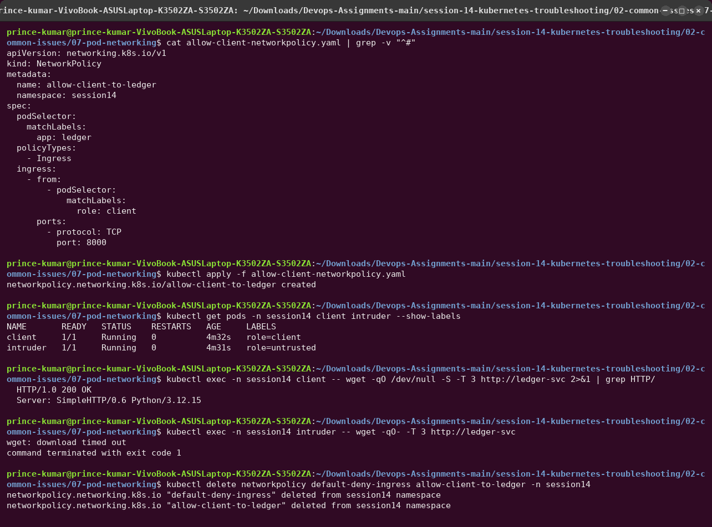

- **Verify:** `client` → `HTTP/1.0 200 OK`; `intruder` (`role=untrusted`) → still
  `timed out`. The policy is selective.

## 8. Configuration issues

[`08-configuration/broken.yaml`](08-configuration/broken.yaml): env refers to ConfigMap key
`LOG_LVL` (the key is `LOG_LEVEL`) and to Secret `db-credentials` (never created).

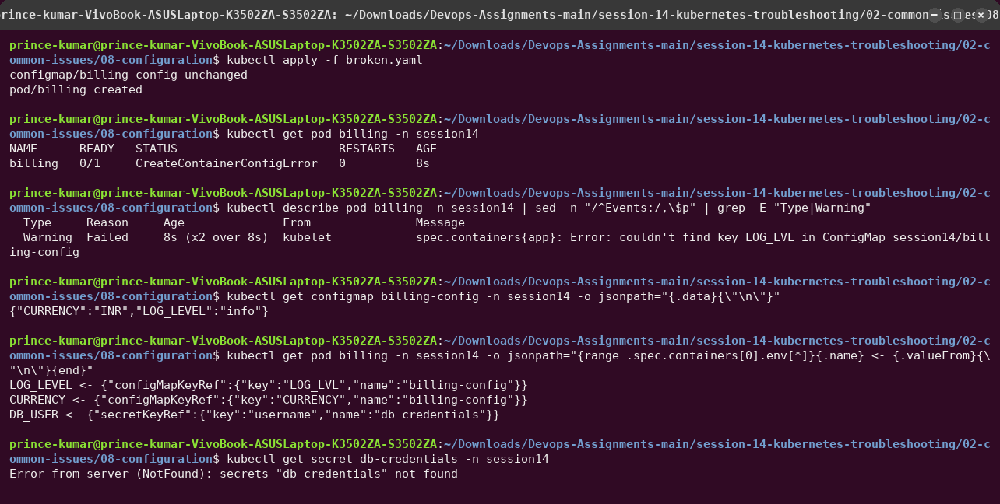

- `CreateContainerConfigError`: the kubelet cannot build the container's config (env/volumes).
- Event: `couldn't find key LOG_LVL in ConfigMap session14/billing-config`. Comparing the env
  references with the ConfigMap's actual keys shows the typo. `get secret db-credentials` →
  `NotFound`.
- Only the **first** error is reported. Fixing the key revealed the second:
  `secret "db-credentials" not found`.

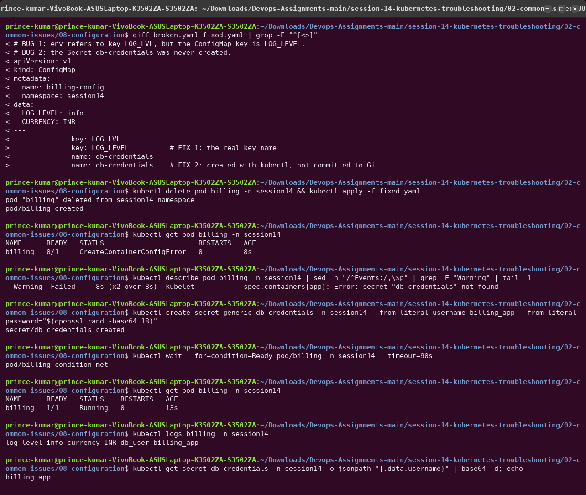

- The Secret was created with `kubectl create secret --from-literal` and a generated password,
  **not** committed as YAML. Secrets are only base64-encoded, so a committed Secret is a
  leaked Secret.
- **Verify:** Pod `1/1 Running`, log `log level=info currency=INR db_user=billing_app`.

## 9. Bonus — OOMKilled

[`09-oomkilled/`](09-oomkilled/): a job builds ~200 MB in memory with a 32Mi limit.

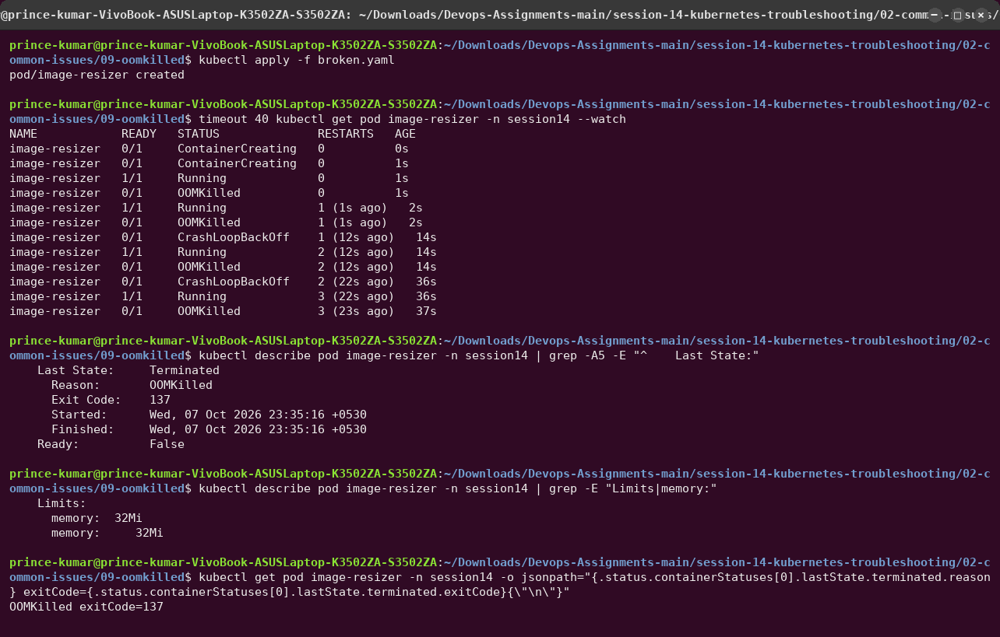

- `OOMKilled`, `Exit Code: 137` (SIGKILL from the kernel's OOM killer, enforced by the
  container's memory cgroup at `limits.memory`).
- **Fix:** request 256Mi / limit 320Mi, sized to the job's real need. (Alternatively, process
  the data in smaller chunks.)

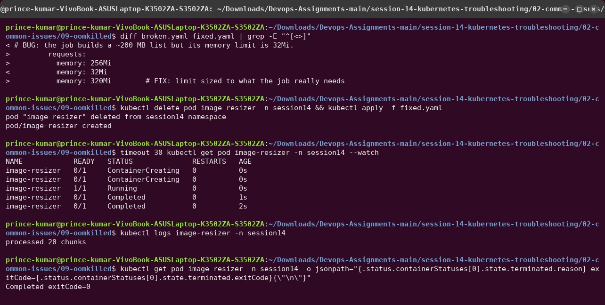

---

## Patterns worth remembering

```text
Pending            → scheduler problem      → describe pod: FailedScheduling
ContainerCreating  → kubelet setup problem  → describe pod: FailedMount / image / CNI
CreateContainerConfigError → env/volume refs → describe pod: missing key / ConfigMap / Secret
ErrImagePull/ImagePullBackOff → registry    → describe pod: NotFound / 401 / 429 / timeout
CrashLoopBackOff   → the app exits          → logs (and --previous), exit code
OOMKilled (137)    → memory limit           → describe pod: Last State, top pods
Running but unreachable → Service/DNS/network → endpoints, labels, ports, netstat, nslookup, NetworkPolicy
```
