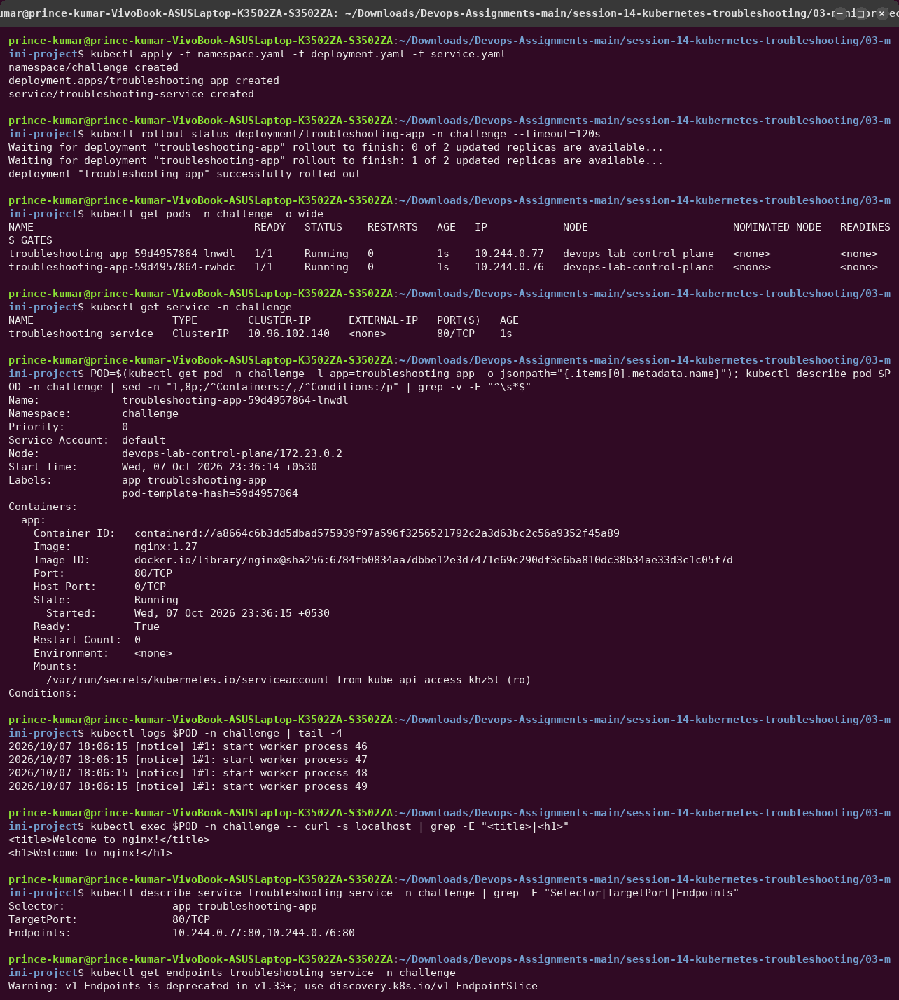
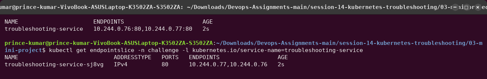
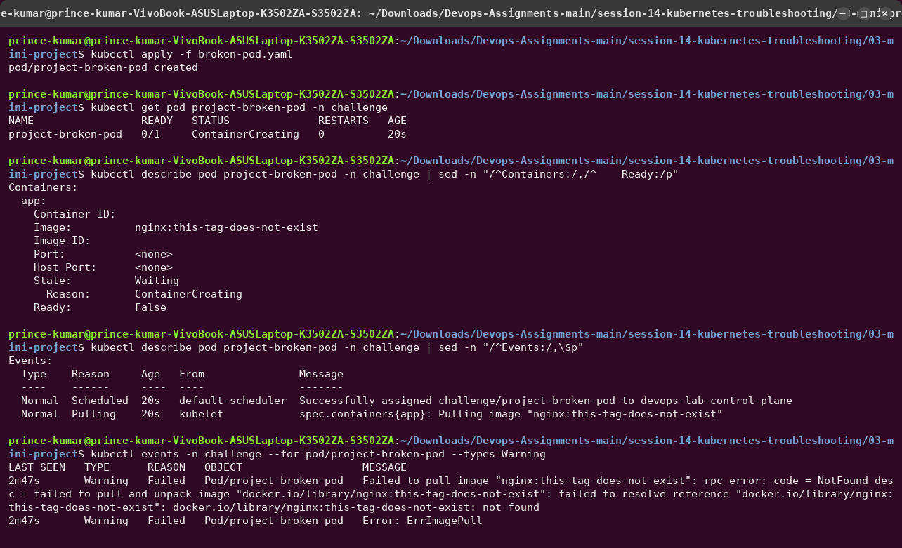
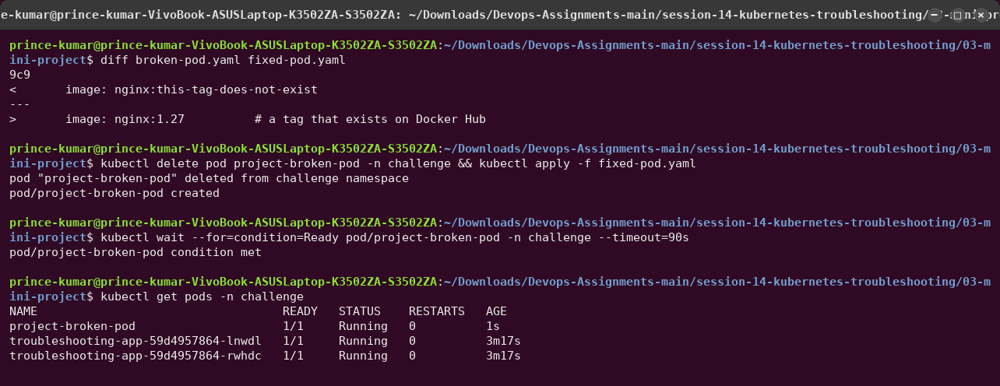

# 03 — Mini Project: Kubernetes Troubleshooting Challenge

```text
Deploy ─► Observe ─► Break ─► Investigate ─► Find root cause ─► Fix ─► Verify
```

Scenario: an nginx app (Deployment + Service + 2 Pods) should be reachable through its
Service, but the team reports problems. Everything runs in the namespace `challenge`.

| File | Purpose |
|---|---|
| [`namespace.yaml`](namespace.yaml) | namespace `challenge` |
| [`deployment.yaml`](deployment.yaml) | `troubleshooting-app`, 2 × nginx:1.27 |
| [`service.yaml`](service.yaml) | `troubleshooting-service`, ClusterIP, selector `app=troubleshooting-app` |
| [`broken-pod.yaml`](broken-pod.yaml) | `project-broken-pod` with image `nginx:this-tag-does-not-exist` |
| [`fixed-pod.yaml`](fixed-pod.yaml) | the same Pod with `nginx:1.27` |
| [`service-wrong-selector.yaml`](service-wrong-selector.yaml) | the Service with `app: wrong-app` (section 8 of the challenge) |

---

## 1–4. Deploy and check the healthy application




- Both Pods `Running` with their own IPs; Service `ClusterIP 10.96.x.x:80`.
- `kubectl exec ... -- curl -s localhost` inside a Pod → `Welcome to nginx!`.
- Service check: **Selector** `app=troubleshooting-app`, **TargetPort** `80/TCP`,
  **Endpoints** = both Pod IPs on port 80. Selector, port and endpoints all agree.
- `kubectl get endpoints` still works but prints
  `Warning: v1 Endpoints is deprecated in v1.33+; use discovery.k8s.io/v1 EndpointSlice`, so
  I used `kubectl get endpointslice` everywhere else.

## 5–6. The broken Pod (investigated before touching the YAML)



## 7. Answers

**Q1. What is the Pod status?**
`ImagePullBackOff` (`READY 0/1`). Between retries it also shows `ErrImagePull`. Container
state: `Waiting`, reason `ImagePullBackOff`.

**Q2. What is the actual error?**
`Failed to pull image "nginx:this-tag-does-not-exist": rpc error: code = NotFound desc =
failed to pull and unpack image "docker.io/library/nginx:this-tag-does-not-exist": failed to
resolve reference ...: not found`.

**Q3. Which command helped you find the reason?**
`kubectl describe pod project-broken-pod -n challenge`, the **Events** section.
`kubectl events -n challenge --for pod/project-broken-pod --types=Warning` shows the same
warnings on their own.

**Q4. What is wrong with the image?**
The repository `nginx` exists on Docker Hub, but the **tag** `this-tag-does-not-exist` does
not. The registry was reachable and answered `NotFound`, so this is not a network,
credentials or rate-limit problem.

**Q5. How would you fix it?**
Use a tag that exists (`nginx:1.27`). Pod `image` can be updated in place, but I recreated
the Pod from [`fixed-pod.yaml`](fixed-pod.yaml) so the file in Git matches what runs. In
general: pin a specific existing tag (or digest), never a guess, and check it first with
`docker manifest inspect nginx:1.27` or the registry UI.



## 8–9. Service selector challenge


- With `selector: app: wrong-app`, the endpoints are `<none>` and `curl` exits with **code 7**
  (failed to connect). The Pods themselves are perfectly healthy.
- `kubectl get pods --show-labels` → Pods carry `app=troubleshooting-app`;
  `kubectl describe service` → `Selector: app=wrong-app`, `Endpoints:` empty.
  **Root cause:** selector ≠ Pod labels.
- Fixed by re-applying [`service.yaml`](service.yaml). Endpoints return, `curl` gets the page,
  and `getent hosts troubleshooting-service.challenge.svc.cluster.local` resolves to the
  ClusterIP.

## 10. Troubleshooting checklist I followed

```bash
kubectl get pods -n challenge -o wide
kubectl describe pod <pod> -n challenge        # status, events
kubectl logs <pod> -n challenge
kubectl exec <pod> -n challenge -- curl -s localhost
kubectl get events -n challenge                # or: kubectl events -n challenge
kubectl describe service <svc> -n challenge    # selector, targetPort, endpoints
kubectl get endpointslice -n challenge -l kubernetes.io/service-name=<svc>
kubectl exec <pod> -n challenge -- getent hosts <svc>.challenge.svc.cluster.local
```

## 11. Troubleshooting table

| Problem | What I saw | Command I used | Root cause | Fix |
|---|---|---|---|---|
| **Broken Pod** | `project-broken-pod` `0/1 ImagePullBackOff`, never started | `kubectl get pod`, `kubectl describe pod` (Events) | the container image could not be pulled, so there was nothing to run | recreate with a valid image (`fixed-pod.yaml`) |
| **Service Problem** | Pods `Running`, but `curl` to the Service fails (exit 7), endpoints `<none>` | `kubectl get endpoints`, `kubectl get pods --show-labels`, `kubectl describe service` | Service selector `app=wrong-app` matches no Pod label | selector back to `app=troubleshooting-app` (`kubectl apply -f service.yaml`) |
| **Image Problem** | `Failed to pull image ... NotFound ... not found` | `kubectl describe pod`, `kubectl events --types=Warning` | tag `this-tag-does-not-exist` does not exist in `docker.io/library/nginx` | use an existing pinned tag, `nginx:1.27` |

## 12. README questions (answered in my own words)

1. **What does `kubectl get` tell us?**
   A one-line summary per object: does it exist, and what state is it in (phase/STATUS,
   READY count, RESTARTS, AGE)? With `-o wide` also IPs and nodes; with `-o yaml/jsonpath` any
   field. It is the "what is happening?" view.

2. **What is the difference between `get` and `describe`?**
   `get` is a table of current state. `describe` is a human-readable report for *one* object:
   the full spec and status (container states, last termination reason, exit codes,
   conditions, mounts, requests/limits) **plus the related Events**. `get` says *that*
   something is wrong; `describe` usually says *why*.

3. **Why do we use `kubectl logs`?**
   To read what the application wrote to stdout/stderr. That is the only place
   application-level errors show up (missing config, stack traces, failed DB connection).
   `--previous` shows the crashed instance, `-c` picks a container, `-l` aggregates replicas.

4. **When would you use `kubectl exec`?**
   When the Pod is running but behaves wrongly and I need to look from the inside: check
   env vars and mounted config files, see which ports the process listens on (`netstat`),
   test `localhost` versus the Pod IP, resolve DNS names, or curl a dependency from the
   Pod's network position. It needs a running container, so it cannot help with
   `Pending`/`ImagePullBackOff`.

5. **What does `CrashLoopBackOff` mean?**
   The container starts and then exits (or is killed) again and again. Kubernetes keeps
   restarting it, waiting longer each time (exponential back-off, 10 s doubling up to 5 min).
   It is a symptom; the cause is in `kubectl logs` and in the exit code / last state in
   `describe`.

6. **What does `ImagePullBackOff` mean?**
   The kubelet could not pull the image (`ErrImagePull`) and is now waiting before retrying.
   Causes: wrong name or tag, private registry without `imagePullSecrets`, registry rate
   limit (429), or no network/DNS to the registry. The event message tells which.

7. **Why can a Pod remain `Pending`?**
   The scheduler cannot find a node for it: not enough allocatable CPU/memory for its
   *requests*, nodeSelector/affinity that no node matches, taints it does not tolerate,
   a PVC that cannot bind (no StorageClass, zone mismatch), or simply no ready nodes. The
   `FailedScheduling` event lists the reason per node.

8. **Why can a Service have no endpoints?**
   No *ready* Pod matches its selector: the selector has a typo or the labels changed, the
   Pods are in another namespace, the Pods are failing readiness, or there are no Pods at all
   (replicas 0, Pods crashing).

9. **What is the relationship between a Service selector and Pod labels?**
   The Service has no fixed list of Pods. Its selector is a label query, and the EndpointSlice
   controller keeps the endpoints equal to "every ready Pod in this namespace whose labels
   match the selector". Labels are the only link: change either side so they no longer
   match, and traffic stops even though every Pod is healthy.

10. **What is Kubernetes DNS?**
    The cluster's internal DNS service (CoreDNS, Service `kube-dns` at `10.96.0.10` here). It
    gives every Service a name, `<service>.<namespace>.svc.cluster.local`, that resolves to its
    ClusterIP (or to Pod IPs for headless Services). Each Pod's `/etc/resolv.conf` points at
    it, with search domains starting at the Pod's own namespace. That is why a short name
    works within a namespace but needs `<service>.<namespace>` from outside it.
