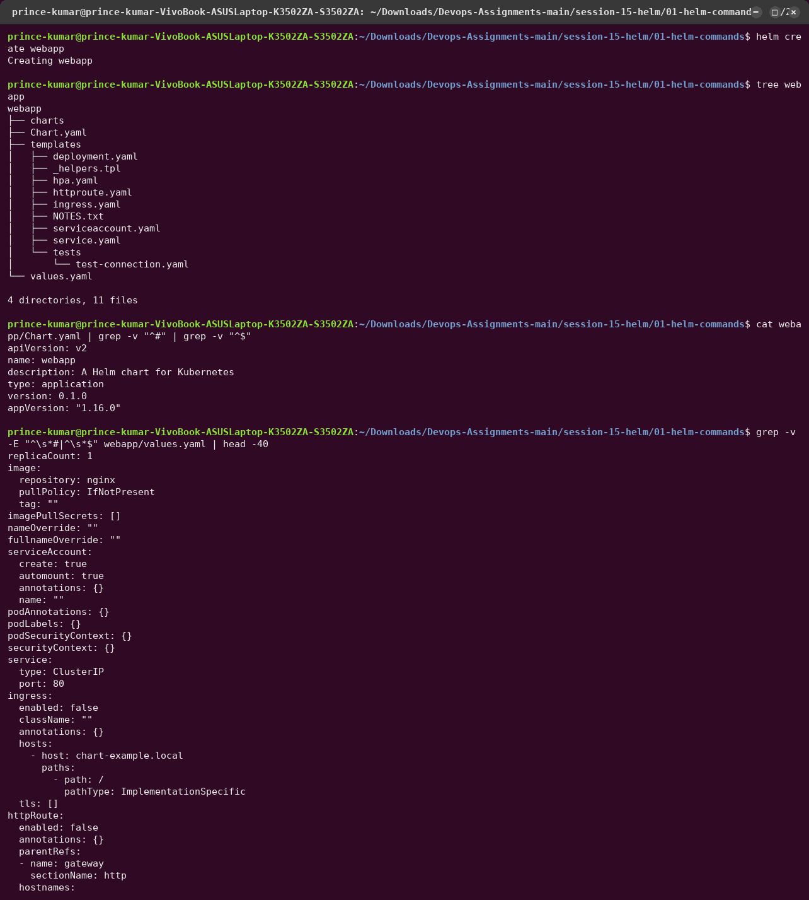
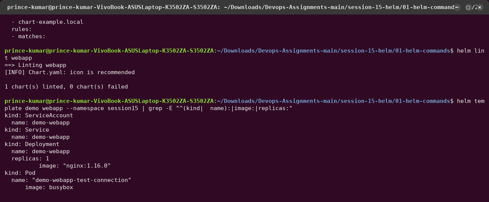
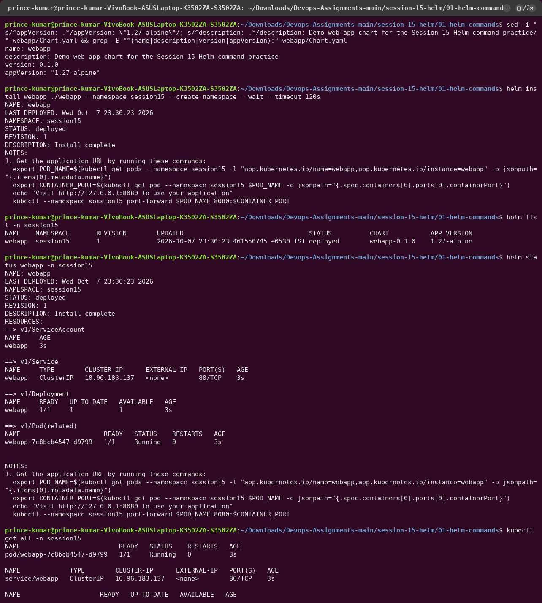
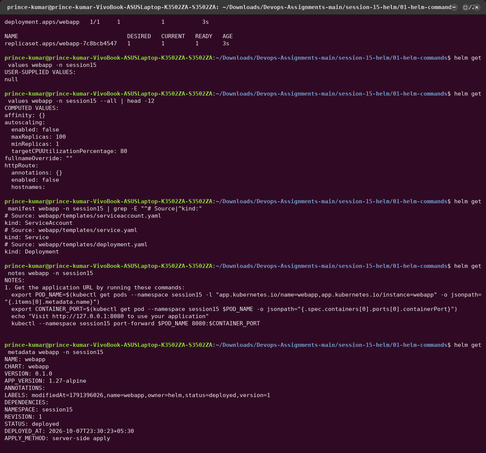
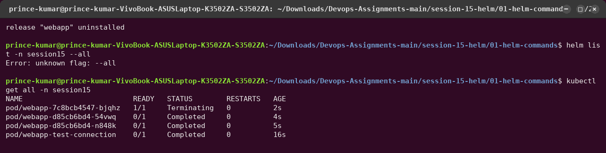
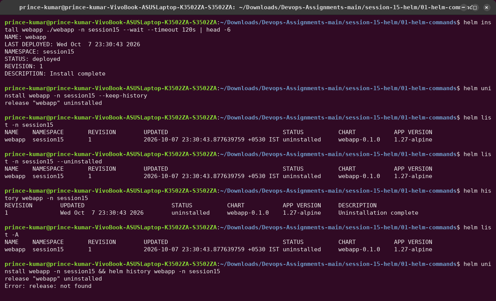
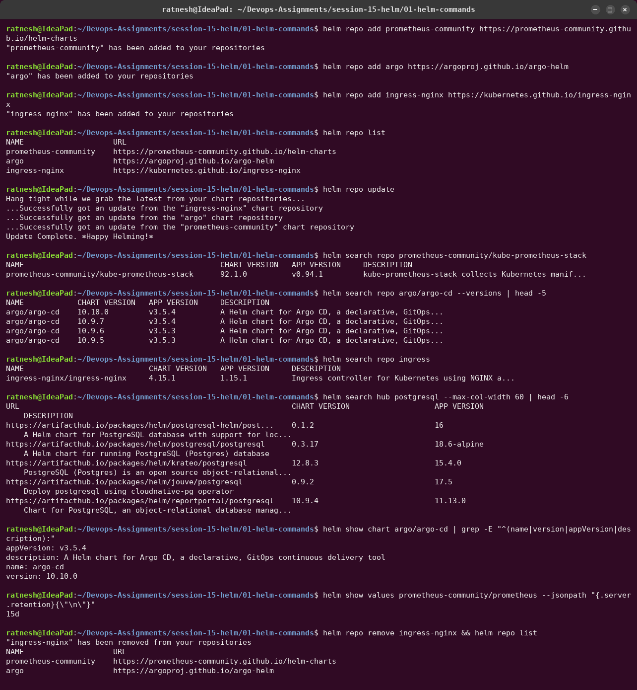

# 01 — Helm Commands

Helm is the package manager for Kubernetes. A **chart** is a folder of templated manifests plus
default values; installing a chart creates a **release**; every install, upgrade or rollback of
that release is a numbered **revision**, stored as a Secret in the release's namespace.

All commands below ran with **Helm v4.3.0** against the kind cluster. The chart
[`webapp/`](webapp/) was generated by `helm create` (only `appVersion`/`description` were
changed, see below).

| Command | What it does |
|---|---|
| `helm create <name>` | scaffold a new chart (Chart.yaml, values.yaml, templates/, tests/) |
| `helm lint <chart>` | check the chart for errors and best-practice warnings |
| `helm template <rel> <chart>` | render the manifests locally without touching the cluster |
| `helm install <rel> <chart>` | render + apply → revision 1 |
| `helm list` | releases in a namespace (`-A` for all namespaces) |
| `helm status <rel>` | state of the latest revision + rendered NOTES |
| `helm get values/manifest/notes/metadata/all <rel>` | what was actually deployed |
| `helm upgrade <rel> <chart>` | apply a new chart/values → next revision |
| `helm history <rel>` | every revision with status and description |
| `helm rollback <rel> <rev>` | redeploy an old revision's manifests as a *new* revision |
| `helm uninstall <rel>` | delete the release's resources (and history, unless `--keep-history`) |
| `helm repo add/list/update/remove` | manage chart repositories |
| `helm search repo/hub` | search added repos / Artifact Hub |
| `helm test <rel>` | run the chart's test hooks |

---

## `helm create`, `helm lint`, `helm template`

- `helm create` gives a working nginx chart: Deployment, Service, ServiceAccount, Ingress,
  HPA, HTTPRoute (Gateway API, new in recent Helm), NOTES.txt, `_helpers.tpl` for names/labels,
  and a `tests/test-connection.yaml` hook.
- `helm lint` → `0 chart(s) failed`; only `icon is recommended`.
- `helm template` showed the default image `nginx:1.16.0`. The template uses
  `.Values.image.tag | default .Chart.AppVersion`, and `helm create` sets `appVersion: 1.16.0`,
  a 2019 release. So the first step of the next transcript sets `appVersion: "1.27-alpine"`.

## `helm install`, `list`, `status`, `get`

- `--create-namespace` creates `session15`; `--wait` returns only when the Pods are ready.
- `helm get values` shows only *user-supplied* values (`null` here); `--all` merges in the
  chart defaults.
- `helm get manifest` = exactly what Helm applied; `helm get notes` = rendered NOTES.txt.
- `helm get metadata` (Helm 4) shows `APPLY_METHOD: server-side apply`. **Helm 4 applies
  with Kubernetes server-side apply by default**; Helm 3 used client-side three-way merges.

## `helm test`, `upgrade`, `history`, `rollback`, `uninstall`

- `helm test` runs the `test-connection` hook Pod (busybox `wget` against the Service) → `Succeeded`.
- `helm upgrade --set replicaCount=3 --set image.tag=1.27.5-alpine` → revision 2;
  the Deployment shows 3/3 with the new image.
- `helm rollback webapp 1` does **not** go back in time. It creates **revision 3** with the
  description `Rollback to 1` and revision 1's manifests: back to 1 replica, `1.27-alpine`.
- `helm list --all` printed `Error: unknown flag: --all`. **Helm 4 removed the flag**,
  because `helm list` now shows releases in every state by default (next screenshot).

- `helm uninstall --keep-history` deletes the resources but keeps the release records, so
  `helm history` still works and the release shows as `uninstalled`.
- A plain `helm uninstall` deletes the history too (`Error: release: not found`).

## `helm repo` and `helm search`

- `helm repo add` registers a chart repository (an HTTP index), `helm repo update` refreshes
  every index (`⎈Happy Helming!⎈`).
- `helm search repo` searches only *added* repos: `kube-prometheus-stack 92.1.0` (app
  `v0.94.1`), `argo-cd` versions with their app versions. `--versions` lists history.
- `helm search hub` searches **Artifact Hub** without adding anything.
- `helm show chart|values|readme` inspects a chart before installing it.
  `--jsonpath "{.server.retention}"` pulled one default: Prometheus keeps 15 days.
- Two of these repos are used later: `prometheus-community` (Session 20/21 monitoring) and
  `argo` (GitOps).
