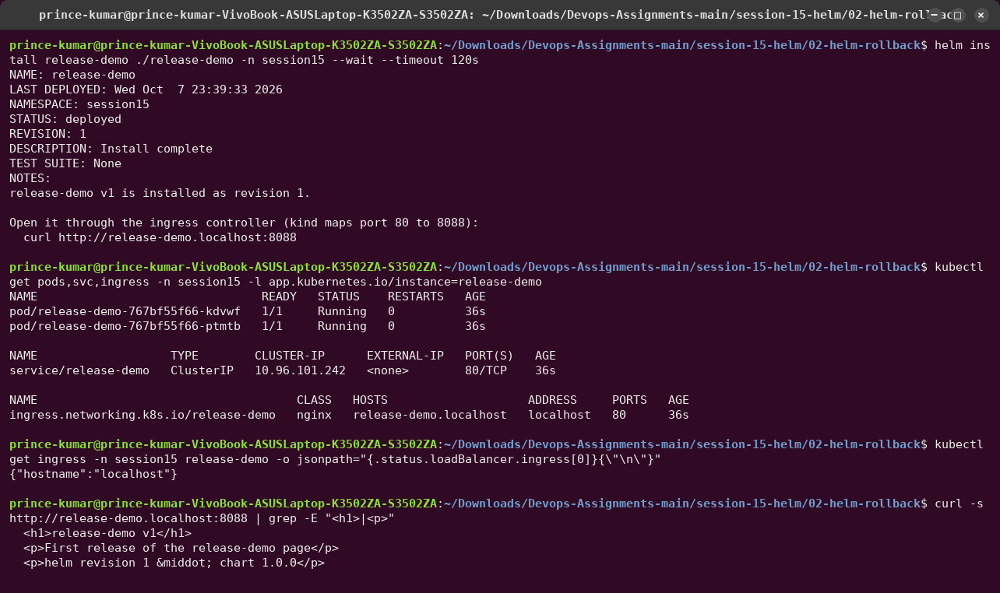
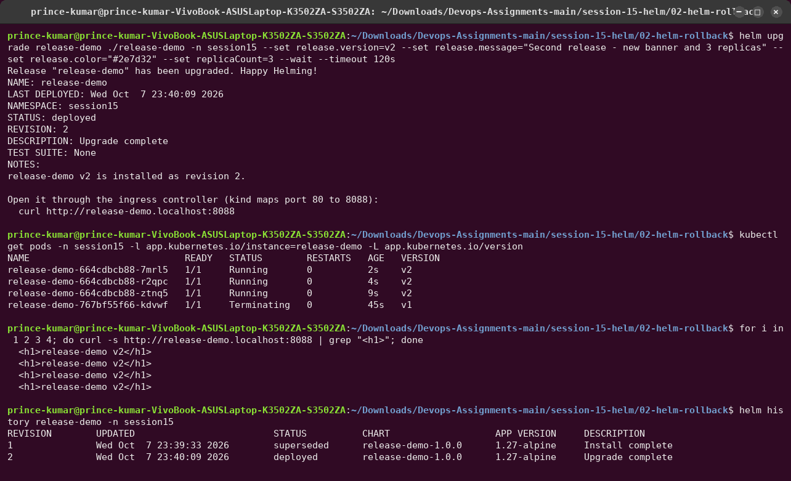
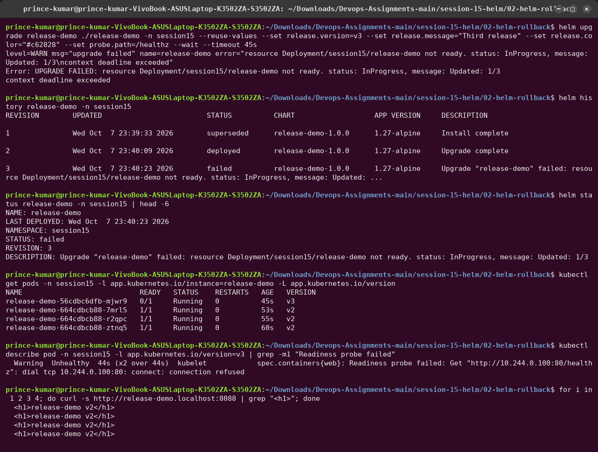
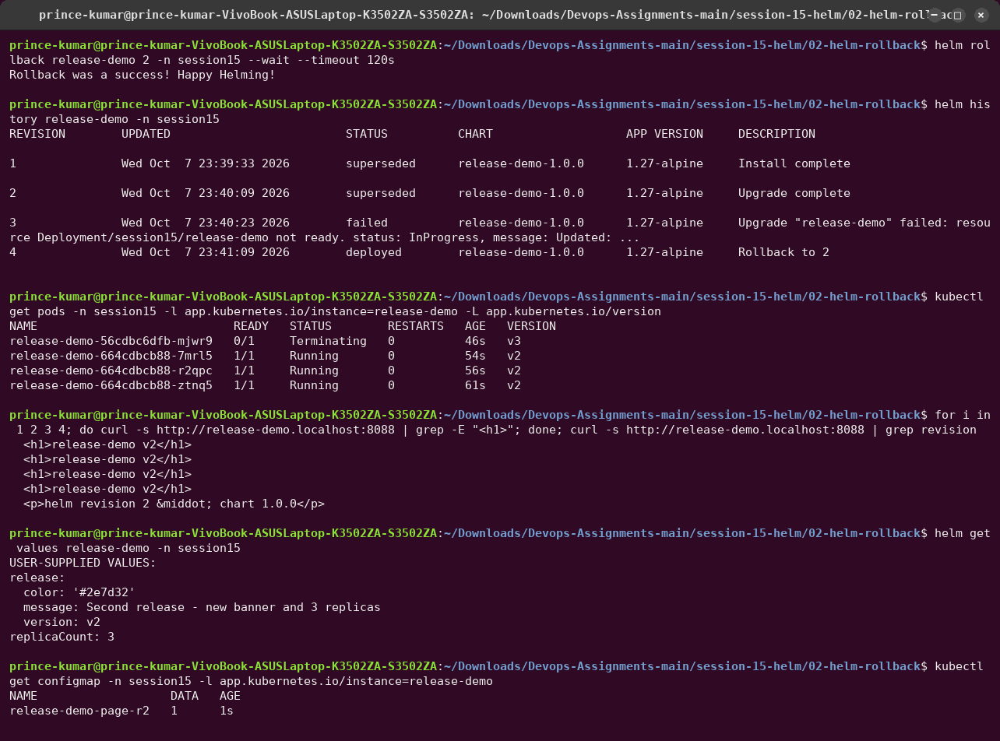

# 02 — Helm Rollback Workflow

```text
Install (v1) → Upgrade (v2) → Verify → Upgrade again (v3, bad) → Verify → Rollback to v2 → Verify
```

## The chart — [`release-demo/`](release-demo/)

Written by hand for this exercise: nginx serving a one-page site that prints **which release is
live**. The version, message and colour come from `values.yaml`, so every upgrade visibly
changes what the Ingress returns.

```text
release-demo/
├── Chart.yaml
├── values.yaml              replicaCount, image, release.{version,message,color}, probe.path, ingress
└── templates/
    ├── _helpers.tpl         fullname + standard app.kubernetes.io labels
    ├── configmap.yaml       index.html, one ConfigMap per revision (…-page-r<revision>)
    ├── deployment.yaml      RollingUpdate maxUnavailable 0 / maxSurge 1, readiness probe on probe.path
    ├── service.yaml
    ├── ingress.yaml         host release-demo.localhost, class nginx
    └── NOTES.txt
```

Two design choices make the rollback demo realistic:

- **`maxUnavailable: 0`.** A new Pod must become Ready before an old one is removed, so a
  broken release never takes the site down.
- **One ConfigMap per revision.** Old Pods keep mounting their own page while new Pods roll
  out. With one shared ConfigMap, the old Pods would start serving the new page within a
  minute, before the new release was even healthy.

Verification uses the ingress controller: kind publishes its port 80 on `localhost:8088`, and
`*.localhost` always resolves to 127.0.0.1, so no `/etc/hosts` edit is needed.

---

## 1. Install — revision 1 (v1)

```bash
helm install release-demo ./release-demo -n session15 --wait --timeout 120s
curl -s http://release-demo.localhost:8088
```



## 2. Upgrade — revision 2 (v2) and verify

```bash
helm upgrade release-demo ./release-demo -n session15 \
  --set release.version=v2 --set release.message="Second release - new banner and 3 replicas" \
  --set release.color="#2e7d32" --set replicaCount=3 --wait --timeout 120s
```



`-L app.kubernetes.io/version` adds a VERSION column: three `v2` Pods, the last `v1` Pod
`Terminating`. All four requests return **v2**.

## 3. Upgrade again — revision 3 (v3) and verify

v3 ships a bug: the readiness probe asks for `/healthz`, which nginx does not serve.
`--reuse-values` keeps v2's settings (3 replicas) and changes only what is passed.

```bash
helm upgrade release-demo ./release-demo -n session15 --reuse-values \
  --set release.version=v3 --set release.message="Third release" --set release.color="#c62828" \
  --set probe.path=/healthz --wait --timeout 45s
```



- Because of `--wait`, Helm watched the rollout and, after 45 s, marked revision 3
  **`failed`**: `resource Deployment/session15/release-demo not ready ... Updated: 1/3`.
- Only **one** v3 Pod was created (`maxSurge: 1`). It stays `0/1` because its readiness
  probe fails, so the rollout cannot continue. The three v2 Pods were never touched
  (`maxUnavailable: 0`).
- Users noticed nothing: every request still returned **v2**.

## 4. Rollback to revision 2 and verify

```bash
helm rollback release-demo 2 -n session15 --wait --timeout 120s
```



- `helm history`: `1 superseded · 2 superseded · 3 failed · 4 deployed "Rollback to 2"`.
  The failed revision stays in history: you can see what happened and when.
- The broken v3 Pod is removed; the three v2 Pods keep running (their Pod template equals
  revision 2's, so nothing needs to restart).
- `curl` → `release-demo v2 … helm revision 2`: the page comes from revision 2's stored
  manifest, and `helm get values` shows revision 2's values again.
- Only `release-demo-page-r2` exists. The rollback deleted revision 3's ConfigMap and
  re-created revision 2's.

## What I took away

| Behaviour | Why it matters |
|---|---|
| `--wait` (+ `--timeout`) | without it Helm reports success as soon as the YAML is applied (see the mini project). With it, a bad release is marked `failed` |
| `--rollback-on-failure` (Helm 4; `--atomic` in Helm 3) | would have rolled back automatically when the wait failed |
| `--reuse-values` vs `-f values.yaml` | `upgrade` without either starts from the chart defaults again |
| rollback creates a new revision | history is append-only, an audit trail of every change |
| `maxUnavailable: 0` + readiness probe | a broken release cannot replace healthy Pods |
