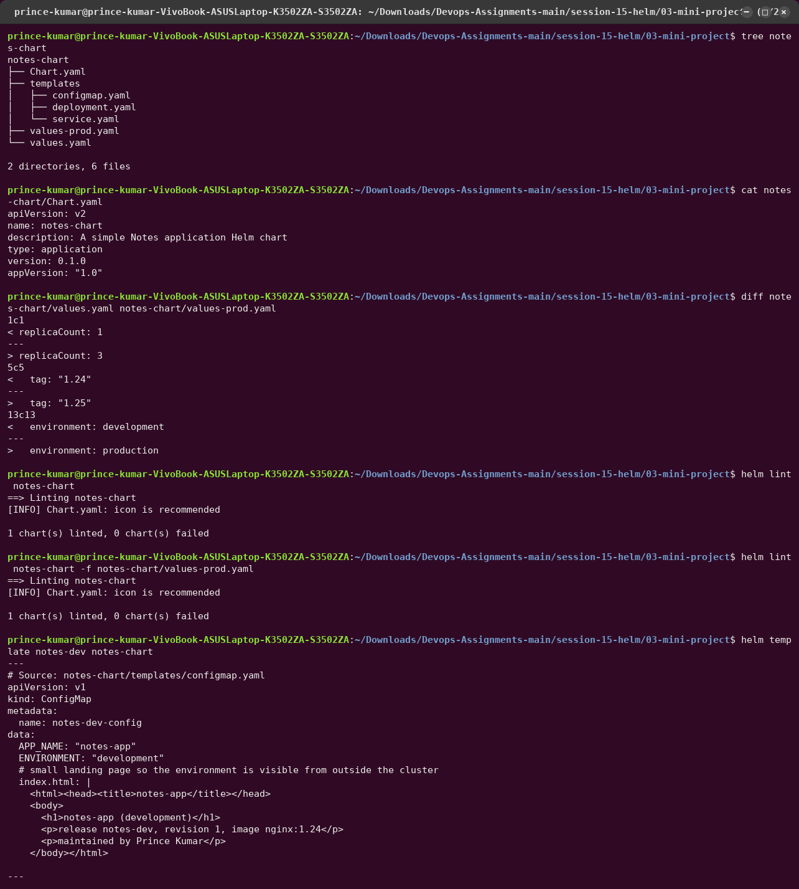
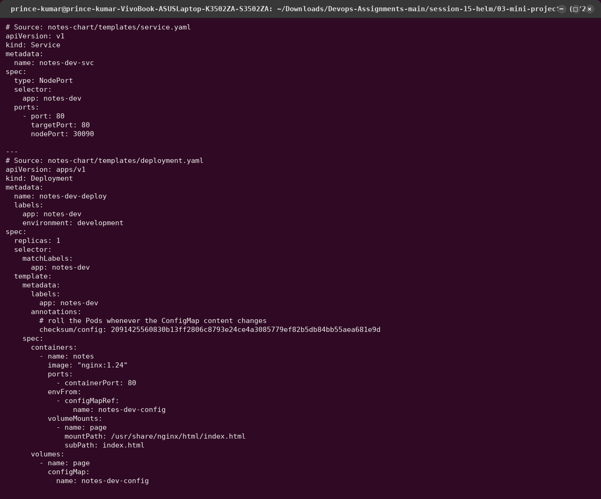
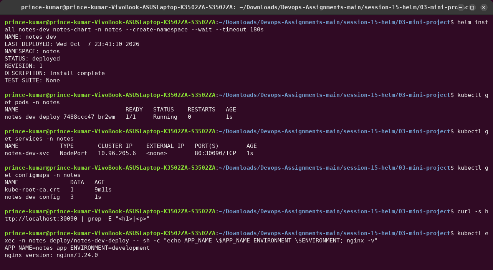
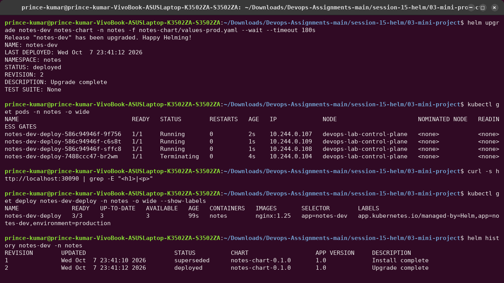
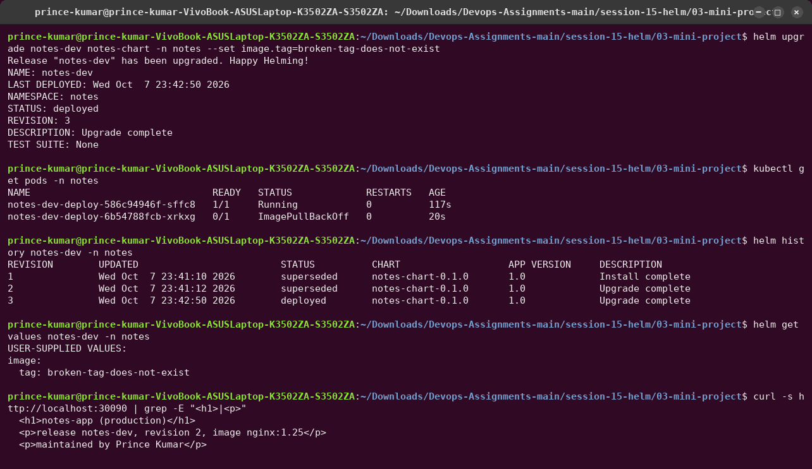
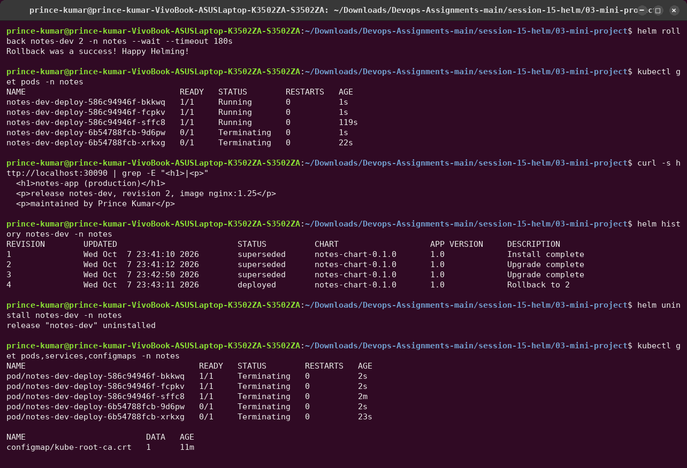

# 03 — Mini Project: Package and Deploy the Notes App with Helm

```text
notes-chart/
├── Chart.yaml
├── values.yaml          development: 1 replica, nginx:1.24
├── values-prod.yaml     production:  3 replicas, nginx:1.25
└── templates/
    ├── configmap.yaml   APP_NAME, ENVIRONMENT (+ index.html landing page)
    ├── deployment.yaml  envFrom the ConfigMap; checksum annotation rolls Pods on config change
    └── service.yaml     NodePort 30090
```

The chart follows the course spec. I added two small things:

- the ConfigMap also renders an `index.html` showing the environment, revision and image, so
  `curl` proves which values are live without exec'ing into Pods;
- a `checksum/config` annotation on the Pod template, so a ConfigMap-only change still rolls
  the Pods. Env vars from a ConfigMap are only read at container start.

Port `30090` is mapped from the kind node to the laptop (see
[`kind-config.yaml`](../../utility/cluster/kind-config.yaml)), so the NodePort answers on
`http://localhost:30090`.

---

## Steps 1–9: Create, lint, render




`helm lint` passes with both values files. In `helm template` output every `{{ }}` is replaced:
`notes-dev-config`, `notes-dev-svc` with `nodePort: 30090`, `notes-dev-deploy` with
`nginx:1.24`.

## Step 10: Install (development)

```bash
helm install notes-dev notes-chart -n notes --create-namespace --wait
```



## Step 11–12: Upgrade to production values, check history

```bash
helm upgrade notes-dev notes-chart -n notes -f notes-chart/values-prod.yaml --wait
helm history notes-dev -n notes
```



3/3 Pods on `nginx:1.25`, the Deployment label is `environment=production`, and the page
says `notes-app (production) … revision 2`.

## Step 13: Simulate a bad upgrade

Run exactly as the course README gives it:

```bash
helm upgrade notes-dev notes-chart -n notes --set image.tag=broken-tag-does-not-exist
```



This step taught three things:

1. **Helm said `STATUS: deployed` / `Upgrade complete`** although the new Pod is in
   `ImagePullBackOff`. Without `--wait`, Helm only checks that the manifests were accepted by
   the API server, not that the app works. Revision 3 is marked `deployed` in history.
2. **The production values were silently dropped.** `helm get values` shows only
   `image.tag: broken-tag-does-not-exist`. `helm upgrade` without `-f values-prod.yaml` or
   `--reuse-values` starts again from the chart's `values.yaml` (development, **1 replica**).
   The Deployment was scaled from 3 to 1, which is why only one old Pod is left.
3. Users still got the old page from that remaining old Pod. A `subPath` ConfigMap mount
   never updates in a running Pod, so it kept serving revision 2's `production` page.

## Step 14: Rollback to revision 2

```bash
helm rollback notes-dev 2 -n notes --wait
```



Three healthy `nginx:1.25` Pods again, and the broken ones terminate. History:
`1 superseded · 2 superseded · 3 superseded · 4 deployed "Rollback to 2"`.

## Step 15: Clean up

`helm uninstall notes-dev -n notes`. The Deployment, Service and ConfigMap are gone (only
the namespace's own `kube-root-ca.crt` remains, and the last Pods are terminating).

## What I practised

```text
[PASS] Created a Helm chart from scratch
[PASS] Used values.yaml and values-prod.yaml
[PASS] Deployed to Kubernetes with helm install
[PASS] Upgraded the release with different values
[PASS] Simulated a bad upgrade (broken image tag) - and saw why --wait and -f matter
[PASS] Rolled back to a healthy revision
[PASS] Cleaned up with helm uninstall
```
